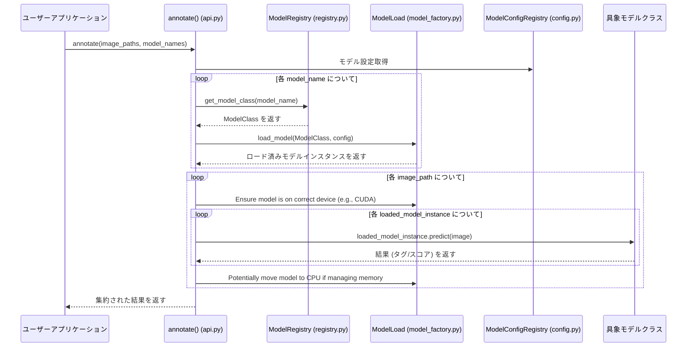

# システムアーキテクチャドキュメント

## 1. アーキテクチャ図 (概念)

```mermaid
graph TD
    subgraph User Interface / Application
        UI(ユーザーアプリケーション / スクリプト)
    end

    subgraph Image Annotator Library (image-annotator-lib)
        API[api.py: annotate()]
        subgraph Core Components
            Factory[core/model_factory.py: ModelLoad]
            Registry[core/registry.py: ModelRegistry]
            Config[core/config.py: ModelConfigRegistry]
            Utils[core/utils.py]
            Exceptions[exceptions/errors.py]
        end
        subgraph Model Classes (model_class/)
            Base[core/base.py: BaseAnnotator]
            FrameworkBase(フレームワーク別基底クラス 例: ONNXBaseAnnotator)
            ConcreteModels(具象モデルクラス 例: WDTagger, AestheticScorer)
        end
    end

    subgraph External Dependencies
        MLModels(MLモデル: ONNX, Transformers, TF)
        PythonLibs(Pythonライブラリ: PyTorch, ONNXRuntime, TF, etc.)
        ConfigFile([config/annotator_config.toml])
    end

    UI --> API
    API --> Factory
    API --> Registry
    API --> Config
    API --> Utils
    API --> Exceptions
    API --> Base

    Factory --> MLModels
    Factory --> Registry
    Factory --> Config
    Registry --> ConcreteModels
    Config --> ConfigFile

    Base --> FrameworkBase
    FrameworkBase --> ConcreteModels
    ConcreteModels --> MLModels
    ConcreteModels --> Utils
    ConcreteModels --> Exceptions
```

## 2. システムワークフロー (概要)

### 2.1 シーケンス図



### 2.2 処理フロー詳細

1.  **初期化とモデル検出:**
    *   `list_available_annotators()` 関数 (内部で `core/registry.py` の機能を使用) が設定ファイル `annotator_config.toml` を読み込み、利用可能モデルを検出。
    *   対応するモデルクラスを `core/registry.py` の機能で検索。
2.  **アノテーション実行:**
    *   ユーザーが `annotate(images, model_names)` を呼び出す。
    *   各 `model_name` に対し、`core/registry.py` の機能で対応クラスを取得しインスタンス化。
    *   `ModelLoad` を使用してモデルをロード(キャッシュも考慮)。
    *   各モデルの `predict` メソッド(`BaseAnnotator` の共通実装)を呼び出す。
        *   `predict` 内部では、画像をチャンク分割し、各チャンクに `_preprocess_images`, `_run_inference`, `_format_predictions`, `_generate_tags` を呼び出す。
    *   結果を集約し、pHash をキーとした最終辞書構造を構築して返却。

### 2.2. Web API アノテーター (`WebApiBaseAnnotator` およびサブクラス)
- **役割**: 外部 Web API (Google Gemini, Anthropic Claude, OpenAI GPT など) を利用して画像のアノテーションを行う。
- **基底クラス**: `WebApiBaseAnnotator`
  - API キーやクライアントインスタンスの管理、基本的なAPI呼び出しフロー(`__enter__`, `__exit__` によるコンテキスト管理など)を提供。
  - **共通の出力フォーマット処理 (`_format_predictions`) を実装**: `_run_inference` から受け取った `list[RawOutput]` を、標準化された `list[WebApiFormattedOutput]` (annotation は dict 型) に変換する責務を持つ。
  - 画像の前処理 (`_preprocess_images`) と推論実行 (`_run_inference`) は抽象メソッドとし、サブクラスでの実装を強制。
- **サブクラス** (例: `GoogleApiAnnotator`, `AnthropicApiAnnotator`):
  - 各 API 固有のクライアント初期化、認証処理を実装。
  - `_preprocess_images`: API が要求する形式 (例: base64 文字列、bytes) に画像を変換。
  - `_run_inference`: 実際に API を呼び出し、レスポンスを取得。内部で Pydantic モデル (`AnnotationSchema`) によるバリデーションを行い、`RawOutput` 型で結果を返す。
  - `_generate_tags`: `_format_predictions` (基底クラスで実行) の結果からタグ情報を抽出 (これは `BaseAnnotator` の抽象メソッド)。

### 2.3. コアモジュール (`core/`)
- **`core/types.py`**: (新規追加)
  - **役割**: プロジェクト全体で共通して使用される型定義 (TypedDict, Pydantic モデル, Enum など) を一元管理する。
  - **目的**: 型定義の重複を防ぎ、循環参照を回避し、保守性と型安全性を向上させる。
  - **依存関係**: このモジュールは依存関係の最下層に位置し、標準ライブラリと外部ライブラリ (Pydantic 等) 以外には依存しない。
  - **主な型**: `AnnotationSchema`, `RawOutput`, `WebApiFormattedOutput`, `WebApiInput`, `WebApiComponents`, `AnnotationResult` など。

### 2.4. 設定ファイル (`resources/system/annotator_config.toml`)

## 3. 主要コンポーネントとアーキテクチャ

### 3.1 設計原則

本ライブラリは、`scorer_wrapper_lib` と `tagger_wrapper_lib` の統合にあたり、以下の原則に基づき設計。

-   **コード重複削減**: 共通機能を基底クラスに集約し、重複実装を排除。
-   **API 統一**: Tagger と Scorer を同一インターフェース(`annotate`関数)で扱えるようにする。
-   **メンテナンス性向上**: クラス構造整理と責務明確化により、将来の修正･変更を容易化。
-   **機能拡張容易化**: 新モデル･フレームワーク追加が容易な構造を目指す。
-   **YAGNI 原則**: 現時点で明確に必要な機能のみ実装し、設計をシンプルに維持。
-   **責任の明確な分離**: 各コンポーネントの役割を明確化。
-   **モデルタイプごとの独立性**: 可能な範囲で、モデルタイプ間の依存を削減。
-   **一貫性のあるメモリ管理**: `ModelLoad` を中心に、統一メモリ管理戦略を適用。

### 3.2 クラス階層 (3層構造)

コード重複回避と責務明確化のため、以下の3層構造クラス階層を採用。

1.  **`BaseAnnotator` (`core/base.py`):**
    *   全アノテーター(Tagger/Scorer)共通の処理とインターフェースを提供。
    *   **責務:** 共通属性初期化、**共通化`predict`メソッド**(チャンク処理、pHash計算、エラーハンドリング、標準結果生成)、サブクラス実装抽象ヘルパーメソッド定義、コンテキスト管理インターフェース定義。
2.  **フレームワーク/タイプ別基底クラス (`core/base.py`, `model_class/annotator_webapi.py`):**
    *   `BaseAnnotator` を継承し、特定MLフレームワーク(ONNX, Transformers等)やタイプ(Web API等)共通処理を実装。
    *   **例:** `ONNXBaseAnnotator`, `TransformersBaseAnnotator`, `TensorflowBaseAnnotator`, `ClipBaseAnnotator`, `PipelineBaseAnnotator`, `WebApiBaseAnnotator`。
    *   **責務:** フレームワーク固有モデルロード/解放ロジック、`BaseAnnotator` 抽象ヘルパーメソッドの一部実装。
3.  **具象モデルクラス (`models/`, `model_class/annotator_webapi.py`):**
    *   対応するフレームワーク/タイプ別基底クラスを継承し、個別モデル固有処理のみ実装。
    *   **例:** `WDTagger`, `BLIPTagger`, `AestheticShadowV1`, `CafePredictor`, `GoogleApiAnnotator`, `OpenAIApiAnnotator`, `AnthropicApiAnnotator`, `OpenRouterApiAnnotator`。
    *   **責務:** モデル固有初期化、ファイル読み込み、必要に応じたヘルパーメソッドのオーバーライド(特に `_generate_tags`、Web APIの場合は `_run_inference` も重要)。

### 3.3 主要コンポーネントの役割

-   **`annotate` 関数 (`api.py`)**: ユーザー向け主要エントリーポイント。複数モデル･複数画像の一括処理を提供。
-   **`ModelLoad` (`core/model_factory.py`)**: モデルのロード、キャッシュ管理、メモリ管理、リソース解放を担当。詳細はセクション4参照。
-   **`ModelRegistry` (`core/registry.py`)**: 利用可能アノテータークラスを設定ファイルと照合し管理。設定名に対応するクラスオブジェクト取得機能 (`get_annotator_class`) や、利用可能モデル名一覧取得機能 (`list_available_annotators`) を提供。
-   **`ModelConfigRegistry` (`core/config.py`)**: TOML ファイルからの設定全体を管理。共有インスタンス `config_registry` 経由で設定値アクセスを提供。
    -   **システム/ユーザー設定分離 (2025-04-20頃):** 内部データをシステム設定とユーザー設定に分離。ユーザー設定がシステム設定を上書きする形でマージされた設定ビューを利用。計算済みモデルサイズ等はシステム設定ファイルに保存。
-   **`core/utils.py`**: 設定ファイル読み込み、モデルサイズ保存、ファイルダウンロード/キャッシュ管理ユーティリティ、ロガー設定等の共通ユーティリティ関数を含む。
-   **共通例外クラス (`exceptions/errors.py`)**: `AnnotatorError`, `ModelLoadError`, `OutOfMemoryError` 等のライブラリ固有カスタム例外を定義。

## 4. 主要コンポーネントの詳細: ModelLoad

### 4.1 ModelLoad

-   **目的**: 機械学習モデルのロード、キャッシュ、メモリ管理。
-   **実装**:
    -   内部的にフレームワーク固有ローダー (`_TransformersLoader`, `_ONNXLoader`, `_TensorFlowLoader`, `_CLIPLoader`) を使用し、モデルサイズ計算、メモリチェック、状態更新等の共通処理をカプセル化。
    -   モデル状態 (`_MODEL_STATES`)、メモリ使用量 (`_MEMORY_USAGE`)、最終使用時刻 (`_MODEL_LAST_USED`) をクラス変数で管理。
    -   LRU (Least Recently Used) 戦略に基づき、キャッシュサイズ上限 (`_CACHE_RATIO` で定義) 超過時に古いモデルを自動解放 (`_clear_cache_internal`)。
    -   公開インターフェースは静的メソッド (`load_..._components`, `cache_to_main_memory`, `restore_model_to_cuda`, `release_model` 等) として提供し、後方互換性を維持。
-   **設計思想:** アノテータークラスは `ModelLoad` 内部状態を意識せず、モデル状態管理とロード/キャッシュ復元/CPU退避等の判断は `ModelLoad` クラスの責任とし、責務を明確に分離。アノテータークラスは `ModelLoad` 提供の高レベルロードメソッドを呼び出す。

### 4.2 モデルロードとメモリ管理の詳細

`ModelLoad` クラスは、効率的モデルロードとメモリ管理のため以下のメカニズムを実装。

1.  **早期サイズ計算とメモリチェック**:
    *   モデルコンポーネントをデバイス(CPU/GPU)ロード前に、モデルメモリフットプリント(MB単位)を特定。
    *   サイズ特定は、内部キャッシュ (`_MODEL_SIZES`) → 設定ファイル (`estimated_size_gb`) → モデルタイプに応じた実計算(CPU上での一時ロード/解析)の順。
    *   計算サイズはキャッシュとシステム設定ファイルに保存し、次回以降ロードを高速化。
    *   特定サイズに基づき、`psutil` で十分なシステムメモリ利用可能か確認。不足時はロード中止し、警告ログ出力。
2.  **キャッシュクリア**:
    *   メモリチェック後、新モデルロードのためキャッシュ内旧モデル削除要否を判断(必要サイズと最大許容キャッシュサイズに基づく)。
    *   LRU戦略に従い、最も最近未使用モデルから順に解放。
3.  **コンポーネントロード**:
    *   メモリチェックとキャッシュクリア後、実際のモデルコンポーネントを指定ターゲットデバイスにロード。

**利点:**

-   **OOMエラー削減:** 大規模モデルロード前の事前メモリチェック。
-   **ロード高速化:** 不明モデルサイズの自動計算･保存による次回以降高速化。
-   **キャッシュ管理改善:** より情報に基づいたキャッシュクリア判断。
-   **標準化フロー:** 異なるモデルタイプ間での一貫ロードプロセス。

### 4.3 コンポーネント間の関係 (簡易図)

```mermaid
graph TD
    Registry[ModelRegistry] --> Factory[ModelLoad]
    Factory -->|ロード/管理| Models(具象モデルインスタンス)
    API[annotate()] --> Registry
    API --> Factory
```

### 4.4 主要な設計決定 (ModelLoad 関連)

-   **早期サイズ計算とメモリ管理強化 (2025-04-20頃):** 上記「4.2 モデルロードとメモリ管理の詳細」で説明のメカニズム実装。
-   **CLIPLoader リファクタリング (2025-04-20頃):**
    -   `_CLIPLoader._create_clip_model_internal` メソッドの複雑度が高かったため、構造推測、ベースコンポーネントロード、分類器ヘッド作成/ロード処理を独立ヘルパーメソッドに分割。
    -   これにより、可読性、保守性が向上し、Ruff C901 違反が解消。
-   **状態変数カプセル化 (2025-04-21頃):**
    -   `_MEMORY_USAGE`, `_MODEL_LAST_USED` 等クラス変数への直接アクセスを、内部ヘルパーメソッド (`_get_current_cache_usage` 等) 経由に変更。
    -   カプセル化、保守性、可読性が向上。

## 5. その他の主要な設計決定

-   **統一 API 採用:** Tagger モデルと Scorer モデルを共通インターフェース (`annotate` 関数) で扱えるようにし、ユーザーはモデル種類を意識せず一貫した方法で利用可能。
-   **pHash ベース結果管理:** 画像知覚ハッシュ(pHash)を結果キーとして使用し、入力/処理順序に依存せず結果を一意に識別。複数モデル結果を効率的に集約。
-   **シンプルユーザーインターフェース:** 最小限 API (`annotate`, `list_available_annotators`) を公開し、大部分処理は内部で自動化。

## 6. Web API アノテーター設計

外部 Web API を利用して画像アノテーションを行う機能。

-   **設計方針:** 既存 `BaseAnnotator` 設計を踏襲し、API プロバイダー毎に専用具象クラスを作成。API キーは `.env` または環境変数で管理し、設定ファイルでモデル名やプロンプト等を管理。戻り値構造は `BaseAnnotator` が生成する標準 `AnnotationResult` を使用。
-   **クラス構成:** `WebApiBaseAnnotator` (`model_class/annotator_webapi.py`) を基底とし、各 API プロバイダー (`Google`, `OpenAI`, `Anthropic`, `OpenRouter`) 毎に具象クラス (`GoogleApiAnnotator`, `OpenAIApiAnnotator` 等) を実装。
-   **共通機能 (`WebApiBaseAnnotator`):**
    -   APIキーの環境変数からの読み込み支援 (実際の読み込みと設定は具象クラスの `__enter__` で行う)。
    -   画像の前処理 (`_preprocess_images`): 多くの場合、Base64エンコードなどを行う共通実装を提供またはサブクラスでオーバーライド。
    -   APIリクエスト送信とレスポンス受信の抽象化 (サブクラスが `_run_inference` で具体的なAPIコールを実装)。
    -   レート制限のための待機処理 (`_wait_for_rate_limit`)。
    -   APIエラーの共通処理 (`_handle_api_error`)。
    -   レスポンスJSONの共通パース処理 (`_parse_common_json_response`)。
    -   共通設定項目 (プロンプトテンプレート、最大トークン数、タイムアウトなど) の設定ファイルからの読み込みと利用。
    -   コンテキスト管理 (`__enter__`, `__exit__`) によるクライアントの初期化とクリーンアップの枠組み提供。
-   **具象クラス (`GoogleApiAnnotator`, `OpenAIApiAnnotator`, `AnthropicApiAnnotator`, `OpenRouterApiAnnotator`):**
    -   `__enter__` メソッド内でのAPIプロバイダー固有クライアントの初期化 (APIキー設定含む)。
    -   `_preprocess_images`: 必要に応じてオーバーライドし、プロバイダー固有の前処理を実装。
    -   `_run_inference`: API プロバイダー固有のリクエスト形式で画像データを送信し、レスポンスを取得する。
    -   `_format_predictions`: API レスポンスを共通の `FormattedOutput` 形式 (またはそれに準ずる中間形式) に整形する。
    -   `_generate_tags`: `_format_predictions` の結果から、最終的なタグリストまたはスコア情報を抽出する (多くの場合、基底クラスのデフォルト実装を利用可能)。
-   **エラーハンドリング:** `_handle_api_error` や各処理ステップでの例外捕捉を通じて、APIキー不足、認証エラー、レート制限超過、APIからのエラーレスポンス、レスポンス形式不正等に対し、`BaseAnnotator` のエラーハンドリング機構を利用し、適切エラーメッセージを含む `AnnotationResult` (`error` フィールドに格納) を返す。致命的な設定不備等は `ConfigurationError` などのカスタム例外を送出。

## テストアーキテクチャの改善 (追記)

現在、プロジェクトの信頼性と安定性を向上させるため、BDD (Behavior Driven Development) テストスイートの大規模な修正と改善作業を行っています。
この取り組みは、以下の点でアーキテクチャ全体の堅牢性に寄与します。

*   **早期の不具合検出:** BDDテストは、システムの振る舞いを自然言語に近い形で記述し、それを自動テストとして実行します。これにより、開発の初期段階で仕様の誤解や実装の不具合を検出しやすくなります。
*   **リグレッション防止:** 包括的なテストスイートを整備し、継続的に実行することで、新たな変更が既存機能に悪影響を与える(リグレッション)のを防ぎます。
*   **仕様の明確化:** `.feature` ファイルは「生きたドキュメント」として機能し、システムの期待される振る舞いを明確に示します。今回の修正作業では、ステップ定義の不足解消や、`datatable` のような曖昧な記述から `Scenario Outline` と `Examples` といったより構造化された形式への移行を進めており、仕様の明確性が向上しています。
*   **保守性の向上:** ステップ定義を共通化 (`conftest.py` や共通ステップファイル) し、各フィーチャー固有のステップと分離することで、テストコードの重複を減らし、保守性を高めています。また、テストランナー (`test_bdd_runner.py`) のインポート構造を整理することで、テスト全体の管理をしやすくしています。

進行中の主な修正点:
*   **`StepDefinitionNotFoundError` の解消:** ほぼ完了。未対応のステップがあれば個別に対応。
*   **Fixture (`datatable`, `scoring_results` 等) の問題解決:** `datatable` は `Scenario Outline` への移行で対応。`scoring_results` は `target_fixture` の利用やステップ間のデータ受け渡し方法の見直しで対応中。
*   **テストと実装間の不整合の修正:** `AssertionError` やその他の実行時エラーの修正。

これにより、開発サイクル全体を通じて品質の高いソフトウェアを提供するための基盤を強化しています。

---
【現状追記】
2025-05-10時点、BDDテストのステップ定義ファイルおよびconftest.pyは全て削除済みであり、BDDテスト実装自体が存在しない。
本セクションの「BDDテストスイートの修正･改善作業」は過去の経緯として参考情報として残す。
今後テストを再開する場合は、「BDDテストは統合テストとしてモック･ダミー･スタブ等を使用しない」現方針に従うこと。

# Google Gemini annotator: レスポンス型･エラーハンドリング設計変更

## 構造的意図
- すべてのWebAPIアノテーターで「annotation+error」ペア型(WebApiFormattedOutput)に統一。
- annotationはdict[str, Any] | None、errorはstr | None。
- フォーマット時にannotationをAnnotationSchemaへ変換、エラー時はNoneを渡す。
- これにより、APIレスポンスの不正･スキーマ不一致･例外も一元的に管理可能。

## 背景
- 外部API(Gemini)の仕様変更･不正レスポンス･バリデーション失敗等、現実的な運用を考慮。
- 型の重複･分岐処理の煩雑化を防ぎ、保守性･拡張性を高めるため。

## 影響
- google_api.pyの推論･フォーマット処理
- テスト･型定義

## 参照日
- 2025-05-10

# 変更履歴(2025-05-10)

## annotator_webapi.py から OpenAIApiAnnotator･AnthropicApiAnnotator 分離の設計的理由
- 各WebAPIアノテーターの責務を明確化し、単一責任原則を徹底するため、annotator_webapi.pyの肥大化･責務混在を解消。
- APIごとの依存･型定義･エラーハンドリングを分離し、保守性･拡張性を向上。
- 新API追加時の影響範囲を限定し、将来的な機能追加･仕様変更に強い構造とした。
- 共通部分(AnnotationSchema等)はwebapi_shared.pyに集約し、API固有部分は各ファイルで管理。

### 影響範囲
- OpenAIApiAnnotator → openai_api_response.py へ移動
- AnthropicApiAnnotator → anthropic_api.py へ移動
- テスト･型定義･依存管理がAPIごとに明確化
- 新API追加･既存API仕様変更時の保守性が大幅に向上

## OpenRouterApiAnnotatorの設計･型･テスト方針(2024/05/10更新)
- OpenRouterApiAnnotatorはOpenAI/RouterレスポンスのcontentをAnnotationSchemaでバリデーションし、型安全な注釈データを生成する。
- レスポンスのパース失敗や型不整合時はエラー内容を明示的に格納。
- テストではAPIクライアント型チェック(isinstance(self.client, OpenAI))を通すため、MagicMockではなくOpenAIインスタンスを利用し、API呼び出しはpatchで差し替え。

---

# 進捗･設計メモ(2025-05-11)

- OpenAI Vision (responses.create) の output_text は、JSON形式またはラベル:値形式(tags: ...)のどちらでも返ることがある。
- まず json.loads でパースし、失敗時のみ正規表現でラベル:値を抽出するカスタムパーサを実装。
- caption/captions の両方に対応し、score/tags も柔軟に抽出。
- これにより、どちらの形式でも AnnotationSchema へ正しく変換でき、全テストがパスした。
- 今後もAPIレスポンス形式の揺れに備え、パース処理は冗長性･堅牢性を持たせる方針とする。

---

## 型定義専用モジュール(types.py)の新設について

2024-xx-xx:
- 共通型(TypedDict, Pydanticモデル等)を一元管理するため、`src/image_annotator_lib/core/types.py` を新設。
- 例:WebApiComponents, 共通input/outputモデル など。
- 型定義専用モジュールは「依存の最下層」に置き、他の自作モジュールに依存しない設計とする。
- これにより循環参照を防止し、保守性･型安全性･拡張性を最大化。
- base.py, model_factory.py, 各APIサブクラス等はすべてtypes.pyから型をimportして利用する。

### 設計意図
- 型定義の重複･分散を防ぎ、どこからでもimportできるようにする。
- PydanticAI化やAPI追加時も型の一元管理が容易。
- テスト･型チェック･自動ドキュメント生成にも流用しやすい。

---