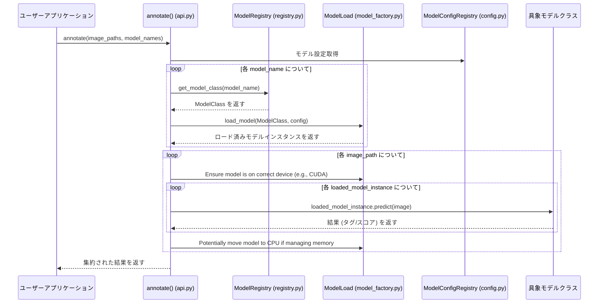

# システムアーキテクチャドキュメント

## 1. アーキテクチャ図 (概念)

```mermaid
graph TD
    subgraph User Interface / Application
        UI(ユーザーアプリケーション / スクリプト)
    end

    subgraph Image Annotator Library (image-annotator-lib)
        API[api.py: annotate()]
        subgraph Core Components
            Factory[core/model_factory.py: ModelLoad]
            Registry[core/registry.py: ModelRegistry]
            Config[core/config.py: ModelConfigRegistry]
            Utils[core/utils.py]
            Exceptions[exceptions/errors.py]
        end
        subgraph Model Classes (model_class/)
            Base[core/base.py: BaseAnnotator]
            FrameworkBase(フレームワーク別基底クラス 例: ONNXBaseAnnotator)
            ConcreteModels(具象モデルクラス 例: WDTagger, AestheticScorer)
        end
    end

    subgraph External Dependencies
        MLModels(MLモデル: ONNX, Transformers, TF)
        PythonLibs(Pythonライブラリ: PyTorch, ONNXRuntime, TF, etc.)
        ConfigFile([config/annotator_config.toml])
    end

    UI --> API
    API --> Factory
    API --> Registry
    API --> Config
    API --> Utils
    API --> Exceptions
    API --> Base

    Factory --> MLModels
    Factory --> Registry
    Factory --> Config
    Registry --> ConcreteModels
    Config --> ConfigFile

    Base --> FrameworkBase
    FrameworkBase --> ConcreteModels
    ConcreteModels --> MLModels
    ConcreteModels --> Utils
    ConcreteModels --> Exceptions
```

## 2. システムワークフロー (概要)

### 2.1 シーケンス図



### 2.2 処理フロー詳細

1.  **初期化とモデル検出:**
    *   `list_available_annotators()` 関数 (内部で `core/registry.py` の機能を使用) が設定ファイル `annotator_config.toml` を読み込み、利用可能モデルを検出。
    *   対応するモデルクラスを `core/registry.py` の機能で検索。
2.  **アノテーション実行:**
    *   ユーザーが `annotate(images, model_names)` を呼び出す。
    *   各 `model_name` に対し、`core/registry.py` の機能で対応クラスを取得しインスタンス化。
    *   `ModelLoad` を使用してモデルをロード（キャッシュも考慮）。
    *   各モデルの `predict` メソッド（`BaseAnnotator` の共通実装）を呼び出す。
        *   `predict` 内部では、画像をチャンク分割し、各チャンクに `_preprocess_images`, `_run_inference`, `_format_predictions`, `_generate_tags` を呼び出す。
    *   結果を集約し、pHash をキーとした最終辞書構造を構築して返却。

## 3. 主要コンポーネントとアーキテクチャ

### 3.1 設計原則

本ライブラリは、`scorer_wrapper_lib` と `tagger_wrapper_lib` の統合にあたり、以下の原則に基づき設計。

-   **コード重複削減**: 共通機能を基底クラスに集約し、重複実装を排除。
-   **API 統一**: Tagger と Scorer を同一インターフェース（`annotate`関数）で扱えるようにする。
-   **メンテナンス性向上**: クラス構造整理と責務明確化により、将来の修正・変更を容易化。
-   **機能拡張容易化**: 新モデル・フレームワーク追加が容易な構造を目指す。
-   **YAGNI 原則**: 現時点で明確に必要な機能のみ実装し、設計をシンプルに維持。
-   **責任の明確な分離**: 各コンポーネントの役割を明確化。
-   **モデルタイプごとの独立性**: 可能な範囲で、モデルタイプ間の依存を削減。
-   **一貫性のあるメモリ管理**: `ModelLoad` を中心に、統一メモリ管理戦略を適用。

### 3.2 クラス階層 (3層構造)

コード重複回避と責務明確化のため、以下の3層構造クラス階層を採用。

1.  **`BaseAnnotator` (`core/base.py`):**
    *   全アノテーター（Tagger/Scorer）共通の処理とインターフェースを提供。
    *   **責務:** 共通属性初期化、**共通化`predict`メソッド**（チャンク処理、pHash計算、エラーハンドリング、標準結果生成）、サブクラス実装抽象ヘルパーメソッド定義、コンテキスト管理インターフェース定義。
2.  **フレームワーク/タイプ別基底クラス (`core/base.py`, `model_class/annotator_webapi.py`):**
    *   `BaseAnnotator` を継承し、特定MLフレームワーク（ONNX, Transformers等）やタイプ（Web API等）共通処理を実装。
    *   **例:** `ONNXBaseAnnotator`, `TransformersBaseAnnotator`, `TensorflowBaseAnnotator`, `ClipBaseAnnotator`, `PipelineBaseAnnotator`, `BaseWebApiAnnotator`。
    *   **責務:** フレームワーク固有モデルロード/解放ロジック、`BaseAnnotator` 抽象ヘルパーメソッドの一部実装。
3.  **具象モデルクラス (`models/`, `model_class/annotator_webapi.py`):**
    *   対応するフレームワーク/タイプ別基底クラスを継承し、個別モデル固有処理のみ実装。
    *   **例:** `WDTagger`, `BLIPTagger`, `AestheticShadowV1`, `CafePredictor`, `GoogleApiAnnotator`。
    *   **責務:** モデル固有初期化、ファイル読み込み、必要に応じたヘルパーメソッドのオーバーライド（特に `_generate_tags`）。

### 3.3 主要コンポーネントの役割

-   **`annotate` 関数 (`api.py`)**: ユーザー向け主要エントリーポイント。複数モデル・複数画像の一括処理を提供。
-   **`ModelLoad` (`core/model_factory.py`)**: モデルのロード、キャッシュ管理、メモリ管理、リソース解放を担当。詳細はセクション4参照。
-   **`ModelRegistry` (`core/registry.py`)**: 利用可能アノテータークラスを設定ファイルと照合し管理。設定名に対応するクラスオブジェクト取得機能 (`get_annotator_class`) や、利用可能モデル名一覧取得機能 (`list_available_annotators`) を提供。
-   **`ModelConfigRegistry` (`core/config.py`)**: TOML ファイルからの設定全体を管理。共有インスタンス `config_registry` 経由で設定値アクセスを提供。
    -   **システム/ユーザー設定分離 (2025-04-20頃):** 内部データをシステム設定とユーザー設定に分離。ユーザー設定がシステム設定を上書きする形でマージされた設定ビューを利用。計算済みモデルサイズ等はシステム設定ファイルに保存。
-   **`core/utils.py`**: 設定ファイル読み込み、モデルサイズ保存、ファイルダウンロード/キャッシュ管理ユーティリティ、ロガー設定等の共通ユーティリティ関数を含む。
-   **共通例外クラス (`exceptions/errors.py`)**: `AnnotatorError`, `ModelLoadError`, `OutOfMemoryError` 等のライブラリ固有カスタム例外を定義。

## 4. 主要コンポーネントの詳細: ModelLoad

### 4.1 ModelLoad

-   **目的**: 機械学習モデルのロード、キャッシュ、メモリ管理。
-   **実装**:
    -   内部的にフレームワーク固有ローダー (`_TransformersLoader`, `_ONNXLoader`, `_TensorFlowLoader`, `_CLIPLoader`) を使用し、モデルサイズ計算、メモリチェック、状態更新等の共通処理をカプセル化。
    -   モデル状態 (`_MODEL_STATES`)、メモリ使用量 (`_MEMORY_USAGE`)、最終使用時刻 (`_MODEL_LAST_USED`) をクラス変数で管理。
    -   LRU (Least Recently Used) 戦略に基づき、キャッシュサイズ上限 (`_CACHE_RATIO` で定義) 超過時に古いモデルを自動解放 (`_clear_cache_internal`)。
    -   公開インターフェースは静的メソッド (`load_..._components`, `cache_to_main_memory`, `restore_model_to_cuda`, `release_model` 等) として提供し、後方互換性を維持。
-   **設計思想:** アノテータークラスは `ModelLoad` 内部状態を意識せず、モデル状態管理とロード/キャッシュ復元/CPU退避等の判断は `ModelLoad` クラスの責任とし、責務を明確に分離。アノテータークラスは `ModelLoad` 提供の高レベルロードメソッドを呼び出す。

### 4.2 モデルロードとメモリ管理の詳細

`ModelLoad` クラスは、効率的モデルロードとメモリ管理のため以下のメカニズムを実装。

1.  **早期サイズ計算とメモリチェック**:
    *   モデルコンポーネントをデバイス（CPU/GPU）ロード前に、モデルメモリフットプリント（MB単位）を特定。
    *   サイズ特定は、内部キャッシュ (`_MODEL_SIZES`) → 設定ファイル (`estimated_size_gb`) → モデルタイプに応じた実計算（CPU上での一時ロード/解析）の順。
    *   計算サイズはキャッシュとシステム設定ファイルに保存し、次回以降ロードを高速化。
    *   特定サイズに基づき、`psutil` で十分なシステムメモリ利用可能か確認。不足時はロード中止し、警告ログ出力。
2.  **キャッシュクリア**:
    *   メモリチェック後、新モデルロードのためキャッシュ内旧モデル削除要否を判断（必要サイズと最大許容キャッシュサイズに基づく）。
    *   LRU戦略に従い、最も最近未使用モデルから順に解放。
3.  **コンポーネントロード**:
    *   メモリチェックとキャッシュクリア後、実際のモデルコンポーネントを指定ターゲットデバイスにロード。

**利点:**

-   **OOMエラー削減:** 大規模モデルロード前の事前メモリチェック。
-   **ロード高速化:** 不明モデルサイズの自動計算・保存による次回以降高速化。
-   **キャッシュ管理改善:** より情報に基づいたキャッシュクリア判断。
-   **標準化フロー:** 異なるモデルタイプ間での一貫ロードプロセス。

### 4.3 コンポーネント間の関係 (簡易図)

```mermaid
graph TD
    Registry[ModelRegistry] --> Factory[ModelLoad]
    Factory -->|ロード/管理| Models(具象モデルインスタンス)
    API[annotate()] --> Registry
    API --> Factory
```

### 4.4 主要な設計決定 (ModelLoad 関連)

-   **早期サイズ計算とメモリ管理強化 (2025-04-20頃):** 上記「4.2 モデルロードとメモリ管理の詳細」で説明のメカニズム実装。
-   **CLIPLoader リファクタリング (2025-04-20頃):**
    -   `_CLIPLoader._create_clip_model_internal` メソッドの複雑度が高かったため、構造推測、ベースコンポーネントロード、分類器ヘッド作成/ロード処理を独立ヘルパーメソッドに分割。
    -   これにより、可読性、保守性が向上し、Ruff C901 違反が解消。
-   **状態変数カプセル化 (2025-04-21頃):**
    -   `_MEMORY_USAGE`, `_MODEL_LAST_USED` 等クラス変数への直接アクセスを、内部ヘルパーメソッド (`_get_current_cache_usage` 等) 経由に変更。
    -   カプセル化、保守性、可読性が向上。

## 5. その他の主要な設計決定

-   **統一 API 採用:** Tagger モデルと Scorer モデルを共通インターフェース (`annotate` 関数) で扱えるようにし、ユーザーはモデル種類を意識せず一貫した方法で利用可能。
-   **pHash ベース結果管理:** 画像知覚ハッシュ(pHash)を結果キーとして使用し、入力/処理順序に依存せず結果を一意に識別。複数モデル結果を効率的に集約。
-   **シンプルユーザーインターフェース:** 最小限 API (`annotate`, `list_available_annotators`) を公開し、大部分処理は内部で自動化。

## 6. Web API アノテーター設計

外部 Web API を利用して画像アノテーションを行う機能。

-   **設計方針:** 既存 `BaseAnnotator` 設計を踏襲し、API プロバイダー毎に専用具象クラスを作成。API キーは `.env` または環境変数で管理し、設定ファイルでモデル名やプロンプト等を管理。戻り値構造は `BaseAnnotator` が生成する標準 `AnnotationResult` を使用。
-   **クラス構成:** `BaseWebApiAnnotator` (`model_class/annotator_webapi.py`) を基底とし、各 API プロバイダー (`Google`, `OpenAI`, `Anthropic`, `OpenRouter`) 毎に具象クラス (`GoogleApiAnnotator`, `OpenAIApiAnnotator` 等) を実装。
-   **共通機能 (`BaseWebApiAnnotator`):**
    -   API キー管理 (`_load_api_key`, `.env` 読み込み)。
    -   画像 Base64 エンコード (`_encode_image`)。
    -   基本的なリクエスト構築・送信ロジックの抽象化 (サブクラスが `_run_inference` で実装)。
    -   レート制限、リトライ機構 (必要に応じてサブクラスまたは共通ヘルパーで実装検討)。
    -   共通エラーハンドリング (タイムアウト、接続エラー等)。
    -   テキスト/JSON レスポンス解析ヘルパー (必要に応じて)。
    -   共通設定項目 (`prompt`, `max_tokens` 等) の読み込み。
-   **具象クラス:**
    -   API プロバイダー固有クライアントの初期化。
    -   `_run_inference`: API 固有のリクエスト形式で画像データを送信し、レスポンスを取得する。
    -   `_generate_tags`: API レスポンスからタグ/スコア情報を抽出し、標準形式 (文字列リスト) に変換する。
-   **エラーハンドリング:** API キー不足、認証エラー、レート制限超過、APIからのエラーレスポンス、レスポンス形式不正等に対し、`BaseAnnotator` のエラーハンドリング機構を利用し、適切エラーメッセージを含む `AnnotationResult` (`error` フィールドに格納) を返す。致命的な設定不備等は例外を送出する可能性もある。