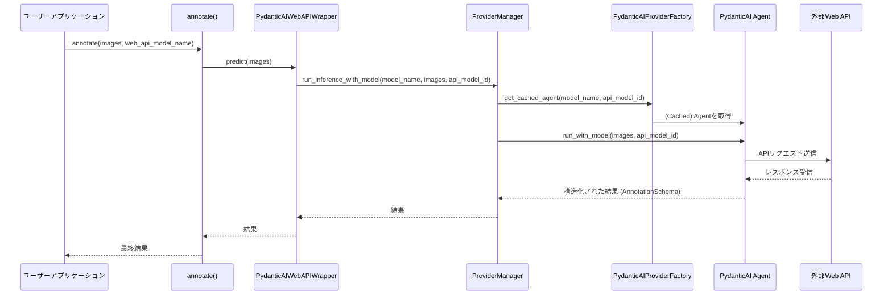
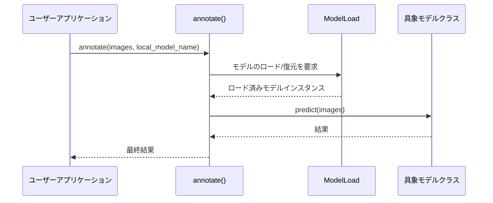

# システムアーキテクチャドキュメント

## 1. アーキテクチャ図 (概念)

```mermaid
graph TD
    subgraph User Application
        UI(ユーザーアプリケーション / スクリプト)
    end

    subgraph Image Annotator Library (image-annotator-lib)
        API[api.py: annotate()]

        subgraph Core Components
            subgraph Provider-Level Management (for Web APIs)
                Wrapper[PydanticAIWebAPIWrapper]
                Manager[ProviderManager]
                Factory[PydanticAIProviderFactory]
            end
            subgraph Legacy & Local Model Management
                ModelLoad[core/model_factory.py: ModelLoad]
            end
            Registry[core/registry.py: ModelRegistry]
            Config[core/config.py: ModelConfigRegistry]
        end

        subgraph Model Classes & Base Classes
            Base[core/base/annotator.py: BaseAnnotator]
            subgraph Local Model Base Classes
                TransformersBase[transformers.py]
                ONNXBase[onnx.py]
            end
            subgraph Web API Base & Mixin
                WebAPIBase[webapi.py: WebApiBaseAnnotator]
                PydanticMixin[pydantic_ai_factory.py: PydanticAIAnnotatorMixin]
            end
            subgraph Concrete Models
                LocalModels(WDTagger, AestheticScorer, etc.)
                WebAPIModels(GoogleApiAnnotator, OpenAIApiAnnotator, etc.)
            end
        end
    end

    subgraph External Dependencies
        WebAPIs(Google, OpenAI, Anthropic APIs)
        LocalMLModels(ONNX, Transformers, etc.)
        ConfigFile([config/annotator_config.toml])
    end

    UI --> API

    API --> Wrapper
    API --> ModelLoad
    API --> Registry
    API --> Config

    Wrapper --> Manager
    Manager --> Factory
    Factory --> WebAPIs

    ModelLoad --> LocalMLModels

    Registry --> LocalModels
    Registry --> WebAPIModels

    LocalModels -- inherits from --> TransformersBase
    WebAPIModels -- inherits from --> WebAPIBase
    WebAPIModels -- inherits from --> PydanticMixin
```

## 2. システムワークフロー

### 2.1 Web API アノテーションのシーケンス図 (Provider-Level)

```mermaid
sequenceDiagram
    participant UserApp as ユーザーアプリケーション
    participant AnnotateAPI as annotate()
    participant Wrapper as PydanticAIWebAPIWrapper
    participant Manager as ProviderManager
    participant Factory as PydanticAIProviderFactory
    participant Agent as PydanticAI Agent
    participant WebAPI as 外部Web API

    UserApp->>AnnotateAPI: annotate(images, web_api_model_name)
    AnnotateAPI->>Wrapper: predict(images)
    Wrapper->>Manager: run_inference_with_model(model_name, images, api_model_id)
    Manager->>Factory: get_cached_agent(model_name, api_model_id)
    Factory->>Agent: (Cached) Agentを取得
    Manager->>Agent: run_with_model(images, api_model_id)
    Agent->>WebAPI: APIリクエスト送信
    WebAPI-->>Agent: レスポンス受信
    Agent-->>Manager: 構造化された結果 (AnnotationSchema)
    Manager-->>Wrapper: 結果
    Wrapper-->>AnnotateAPI: 結果
    AnnotateAPI-->>UserApp: 最終結果
```

### 2.2 ローカルモデル アノテーションのシーケンス図

```mermaid
sequenceDiagram
    participant UserApp as ユーザーアプリケーション
    participant AnnotateAPI as annotate()
    participant ModelLoad as ModelLoad
    participant ModelClass as 具象モデルクラス

    UserApp->>AnnotateAPI: annotate(images, local_model_name)
    AnnotateAPI->>ModelLoad: モデルのロード/復元を要求
    ModelLoad-->>AnnotateAPI: ロード済みモデルインスタンス
    AnnotateAPI->>ModelClass: predict(images)
    ModelClass-->>AnnotateAPI: 結果
    AnnotateAPI-->>UserApp: 最終結果
```

## 3. 主要コンポーネントとアーキテクチャ

### 3.1 設計原則

- **コード重複削減**: 共通機能を基底クラスやミックスインに集約。
- **API 統一**: `annotate()` 関数を通じて、ローカルモデルとWeb APIモデルを透過的に扱う。
- **責務の分離**: モデルのロード、設定管理、API連携など、各コンポーネントの役割を明確化。
- **効率的なリソース管理**:
    - **モデル**: `ModelLoad` によるLRUキャッシュとメモリ管理。
    - **Web APIモデル**: `ProviderManager` と `PydanticAIProviderFactory` によるクライアントとAgentの共有・再利用。

### 3.2 クラス階層と構造

1.  **`BaseAnnotator` (`core/base/annotator.py`)**:
    - 全てのアノテータの最上位基底クラス。
    - `predict` メソッドの共通インターフェースと基本的な処理フローを定義。

2.  **ローカルモデル系基底クラス (`core/base/`)**:
    - `TransformersBaseAnnotator`, `ONNXBaseAnnotator` など。
    - 特定のMLフレームワークに共通する処理を実装。

3.  **Web API系基底クラスとミックスイン**:
    - **`WebApiBaseAnnotator` (`core/base/webapi.py`)**: Web API利用の共通処理（レート制限、エラーハンドリングなど）を提供。
    - **`PydanticAIAnnotatorMixin` (`core/pydantic_ai_factory.py`)**: `pydantic-ai` を利用するための共通ロジック（Agentのセットアップ、推論実行など）を提供。

4.  **具象モデルクラス (`model_class/`)**:
    - **ローカルモデル**: `WDTagger` など。対応するフレームワーク基底クラスを継承。
    - **Web APIモデル**: `GoogleApiAnnotator`, `OpenAIApiAnnotator` など。`WebApiBaseAnnotator` と `PydanticAIAnnotatorMixin` の両方を継承し、各APIプロバイダー固有の処理を実装。

### 3.3 PydanticAI Provider-levelアーキテクチャ (2025-06-25 統合完了、2025-07-02 改善)

Web APIを利用するモデルの効率性と拡張性を最大化するための核心的なアーキテクチャ。

-   **`PydanticAIWebAPIWrapper` (`api.py`)**:
    - 既存の`annotate()` APIとProvider-levelシステム間のブリッジ。
    - PydanticAIを利用するアノテータを自動検出し、`ProviderManager` に処理を委譲する。
    - 完全な後方互換性を維持する。

-   **`ProviderManager` (`core/provider_manager.py`)**:
    - Provider-levelでの推論実行を中央管理する。
    - モデルIDから適切なプロバイダー（Google, OpenAIなど）を自動で選択する。
    - `PydanticAIProviderFactory` を通じて、効率的に `Agent` を取得し、推論を実行させる。
    - **非同期処理安全化**: `_run_agent_safely()` メソッドによる堅牢なEvent loop管理を実装。

-   **`PydanticAIProviderFactory` (`core/pydantic_ai_factory.py`)**:
    - `pydantic-ai` の `Agent` と `Provider` インスタンスを生成・管理するファクトリ。
    - `Provider` インスタンスをキャッシュし、同じプロバイダーへの接続を再利用する。
    - `Agent` インスタンスをLRU戦略でキャッシュし、設定が変更された場合は再生成する。
    - **テスト環境検出強化**: BDDテスト、スタックフレーム検査による確実なテスト環境認識を実装。
    - これにより、APIクライアントの初期化コストを削減し、メモリ使用量を最適化する。

#### アーキテクチャの利点

- **メモリ効率**: 単一の `Provider` インスタンスを複数モデルリクエスト間で共有することで、メモリフットプリントを大幅に削減。
- **パフォーマンス**: `Agent` のキャッシングにより、リクエストごとの初期化オーバーヘッドを最小化。
- **スケーラビリティ**: 多数のAPIモデルを効率的にサポート可能。
- **保守性**: プロバイダーごとの管理が一元化され、新しいAPIの追加や設定変更が容易。
- **堅牢性**: Event loop管理の安全化により、非同期処理での「Event loop is closed」エラーを防止。
- **テスト容易性**: 強化されたテスト環境検出により、テスト時の動作が予測可能。

## 4. 主要コンポーネントの詳細

### 4.1 ModelLoad (ローカルモデル用)

- **目的**: ローカルMLモデルのロード、キャッシュ、メモリ管理。
- **実装**:
    - LRU (Least Recently Used) 戦略に基づき、キャッシュ上限を超過した場合に古いモデルを自動で解放する。
    - モデルをロードする前に必要なメモリを計算し、不足している場合はOOMエラーを未然に防ぐ。

### 4.2 ModelRegistry と ModelConfigRegistry

- **`ModelRegistry` (`core/registry.py`)**: 設定ファイル（`annotator_config.toml`）と具象モデルクラスをマッピングし、利用可能なアノテータを管理する。
- **`ModelConfigRegistry` (`core/config.py`)**: TOMLファイルから全ての設定を読み込み、システム全体に提供する。システム設定とユーザー設定をマージして利用する。

## 5. テストアーキテクチャ

- **テストフレームワーク**: `pytest` を使用。
- **テストの種類**:
    - **ユニットテスト (`tests/unit/`)**: 各コンポーネントを独立してテスト。`@patch` を用いて外部依存をモック化。
    - **統合テスト (`tests/integration/`)**: 複数のコンポーネントを連携させてテスト。実際のAPIコールやモデ��ロードを含む。
    - **BDDテスト (`tests/features/`)**: `pytest-bdd` を使用したビヘイビア駆動テスト。ユーザー視点でのシナリオを検証。
        - **ステップ定義**: `tests/features/step_definitions/` にステップ定義を配置。
        - **共通ステップ**: `common_steps.py` にモデルレジストリ初期化等の共通処理を定義。
        - **WebAPIステップ**: `webapi_annotate_steps.py` にWebAPI特有のテストロジックを実装。
- **並列実行**: `pytest-xdist` を導入し、テストの実行時間を短縮。
- **カバレッジ**: `pytest-cov` でテストカバレッジを計測し、コード品質を維持。
- **型安全性**: `AnnotationResult` は `TypedDict` のため、テストでは辞書アクセス（`.get()`）を統一使用。

## 6. エラーハンドリングと堅牢性

### 6.1 PydanticAI非同期処理の安全化

**問題**: PydanticAIライブラリの非同期処理において「Event loop is closed」エラーが発生する可能性。

**解決策**: `ProviderManager._run_agent_safely()` メソッドによる段階的フォールバック処理：
1. **第一段階**: `agent.run_sync()` を優先実行
2. **第二段階**: RuntimeError発生時、新しいスレッドで独立したEvent loopを作成して実行
3. **エラーハンドリング**: 詳細なログ出力とエラー情報の保持

### 6.2 テスト環境検出の強化

**目的**: テスト実行時の動作を確実に制御し、実APIへの不要なリクエストを防止。

**実装**:
- **多重検証**: 環境変数、sys.modules、コマンドライン引数、BDDテスト、スタックフレーム検査
- **デバッグ対応**: テスト環境検出状況の詳細ログ出力
- **TestModel使用**: テスト環境では `pydantic-ai` の `TestModel` を自動選択

### 6.3 BDDテストのエラーハンドリング

**スキップ条件**: API側の一時的な問題や設定問題を適切に識別してスキップ：
- Google API の空レスポンス・予期せぬ構造
- APIキー未設定
- Event loop関連エラー
- モデルレジストリの問題

**エラー分類**: テストで検出されるエラーを「コードの問題」と「環境・設定の問題」に適切に分類。
