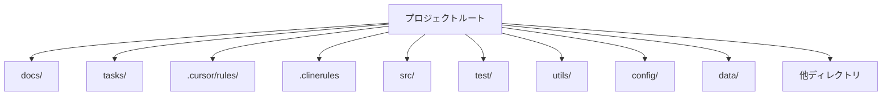
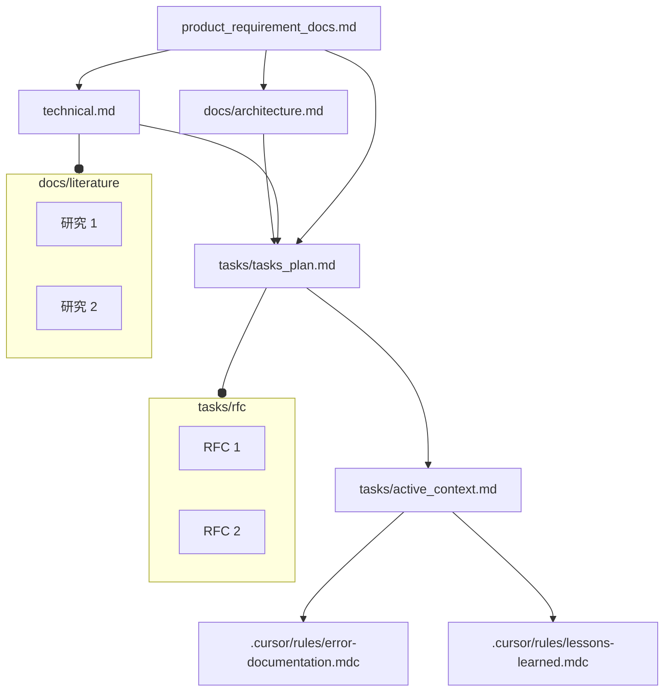

# V2: アップデート [大幅トークン節約]
## 1. 命令テンプレートはアジャイル開発手法(SDLC)とソフトウェア工学ベストプラクティス準拠。
## 2. **3新モード**(トークン削減)をCursor/RooCodeに追加。
## 3. 300+ユーザー使用の安定版ベース、**アジャイル**ワークフロー準拠。
## 変更履歴:
1. (a) Cursor、(b) CLINE、(c) RooCode、(d) 他からのルール分離・独立性は非常に正確。
    a. 1ファイル定義、再利用にシンボリックリンク作成。
    b. Cursor用`.cursor/rules/`に元ファイル。`.roo/`、`.clinerules/`は元ファイルへのシンボリックリンク。

2. (a) RooCode、(b) Cursorカスタムモードでトークン節約。デフォルト上書き用に広範キュレーション済みシステムプロンプト。
3. Roo Code/CLINE最新カスタムプロンプト構文準拠に更新。
---
---
# 動機:
AIコーディング用、包括的・最適なカスタムユーザープロンプト(ルール)を持つこと。出力**品質**は$[response Quality = f(prompt, LLM model)]$の関数であり、ルールは非常に必要。最高性能には、LLMに探索・学習の自由を与えつつ詳細指示が必要。多既存ルール読込、自ルール実験後、実ユースケーステスト済としてこれらを最終決定。
**適用:** エージェント製品構築、AI研究論文執筆でテスト済。
## 対象読者: 初心者フレンドリー&経験者向け潜在力解放。
事前知識なくAI探求、AI/LLM/エージェント状況を体験中の人々と、ワークフローにAI適応・統合中の経験者の両方。良プロンプトは良出力に繋がる可能性。

## 特徴:
1. **クロスプラットフォーム互換:** *任意*IDE、*任意*数の別PCで同プロジェクトに使用可！ Cursor、CLINE、RooCodeルールガイドライン・機構をネイティブ尊重。CLINEルールは**PLANモード**、RooCodeは**Architectモード**使用。同様にCLINEは**Actモード**、RooCodeは**Codeモード**。RooCode**Debugモード**追加使用。
2. **最新互換:** Cursor/CLINE/RooCode最新版互換設計。Cursorは`.cursor/rules/`使用、非推奨`.cursorrules`廃止。RooCodeは`.roo/`とサブディレクトリ使用、`.clinerules`ファイル不使用。CLINEはサブディレクトリ付`.clinerules/`使用、**非推奨**`.clinerules`ファイル**不使用**。
3. **最小トークン使用:** **可能な限りトークン使用量抑制**努力。(a) RooCode/Cursorに新モード組込、タスク効率実行しつつ最小トークン使用。(b) 関連コンテキストのみロード。
- ルールファイルはオンデマンドロード整理。Cursorはルールを`.cursor/rules/`内別`.mdc`ファイルに分離、必要時のみ追加構成。RooCodeはルールをモード固有`.roo/rules-{mode}/`に分離、全`.clinerules`ファイル不使用。これにより対応モード必要ルールのみロード。CLINEは回避策実施も、カスタムプロンプトトークン節約サポート少。
4. **共通メモリバンク:** 全AIアシスタント共通メモリバンク。全AIアシスタント間で同コンテキスト維持。
5. **基本ソフトウェア工学原則:** AIがソフトウェア開発ベストプラクティス準拠保証用。**アジャイル**開発ワークフロー。
話はここまで、開始。
5. **計画/実装/デバッグ後ドキュメント自動更新:** カスタムプロンプトは変更後常時ドキュメント更新設計。構築集中、他はAI処理。

## クイックスタート: AIコーディングに本テンプレート使用

### 基本設定:
本テンプレートはAIペアコーディングプロジェクト開始点提供。即時開始:

1.  **Cursor:** プロジェクトルートに`.cursor/rules/`配置。
2.  **RooCode:** プロジェクトルートに`.roo/`配置。
3.  **CLINE:** プロジェクトルートに`.clinerules/`配置。

*注意: 全て同時積重可。*

**基本設定完了**
カスタムプロンプト・メモリバンク設定。残りはカスタムモード。必須ではないが、トークン($$)節約したい場合実行。
**注意: 本リポジトリから`.git`ファイルコピー禁止。注意して回避。**
---

### 詳細設定:
Cursor/Roo-Codeでカスタムモード作成。CLINE未サポート。CLINEユーザーのみスキップ可。

*Roo Code確認推奨(CLINE使用時、ほぼ同)。*
## Roo Code
### Chatモード

Step 1: プロンプトへ移動。


本様2番目アイコンクリック、カーソル合わせ「プロンプト」表示。

Step 2:

「**モード**」セクションで「**+**」クリック。

Step 3:

- 名前: Chat
- スラッグ: chat
- 保存場所: グローバル
- ロール定義: 包括的に深く思考。
- 利用可能ツール: **なし**
- カスタム指示:

画像通り実行。

Step 4:
下部「**モードを作成**」ボタンクリック。
以下表示:


残り全ては`.roo/system-prompt-chat`に存在。

### Writeモード

Step 3:

- 名前: Write
- スラッグ: write
- 保存場所: グローバル
- ロール定義: ファイル・ディレクトリ作成編集。全読書操作・コマンド実行専用モード。
- 利用可能ツール: 1. ファイル読取、2. ファイル編集、3. コマンド実行
- カスタム指示:
画像通り実行。

Step 4:
下部「**モードを作成**」ボタンクリック。
以下表示:


残り全ては`.roo/system-prompt-write`に存在。

### MCPモード
Step 3:

- 名前: MCP
- スラッグ: mcp
- 保存場所: グローバル
- ロール定義: 接続済MCPサーバー使用。
- 利用可能ツール: 1. MCP使用
- カスタム指示:
画像通り実行。

Step 4:
下部「**モードを作成**」ボタンクリック。
以下表示:


残り全ては`.roo/system-prompt-mcp`に存在。
## Cursor

### Chatモード

Step 1:
モードセクション「カスタムモードを追加」へ移動。


Step 2:

画像通り入力。

「*詳細オプション*」カスタム指示ボックスに以下貼付:

> 1. 可能限り多明確化・詳細フォローアップ要求。
>2. 問題を主要概念・小サブ問題へ繰返分解。
>3. 可能全方向探索。
>4. 超厳密・深推論。
>5. 超詳細・分析的。


### Writeモード


Step 2:

画像通り入力。

「*詳細オプション*」カスタム指示ボックスに以下貼付:
>ファイル・ディレクトリ作成編集。

### MCPモード


Step 2:

画像通り入力。

「*詳細オプション*」カスタム指示ボックスに以下貼付:
>接続済MCPサーバー実行。MCP専用モード、読書・コマンド実行は他モード使用。

---

**使用:** 同機能全て備えつつトークン・費用節約。性能必須ではない。不要トークン節約したい場合のみ実行。

### カスタムモード作成完了!

---
---
## ディレクトリ構造
プロジェクト用に本ディレクトリ構造作成:

1. **`docs/`**

    ├── **`literature/`**

    ├── **`architecture.md`**

    ├── **`technical.md`**

    └── **`product_requirement_docs.md`**

2. **`tasks/`**

    ├── **`rfc/`**

    ├── **`active_context.md`**

    ├── **`tasks_plan.md`**
3. **`src/`**
4. **`test/`**
5. **`utils/`**
6. **`config/`**
7. **`data/`**


Cursor/CLINE/RooCode/他使用しコーディング開始のみ。

**注意: 既存プロジェクトは上記手順従い、更にAIへプロンプト付与:**

> カスタムプロンプト従い、メモリファイル内プロジェクト初期化・文書化、メモリファイル文書化構造・指示準拠。プロジェクト関連全てメモリファイル書込、プロジェクト良コンテキスト構築。

(最初のプロンプトとして上記コピー!)

### シンボリックリンク(自動設定済):

完了済、何も不要。参考情報。

#### .roo/
1. `.roo/rules/memory.mdc`は`.cursor/rules/memeory.mdc`へのシンボリックリンク有。
2. `.roo/rules/directory-structure.mdc`は`.cursor/rules/directory-structure.mdc`へのシンボリックリンク有。
3. `.roo/rules/rules.mdc`は`.cursor/rules/rules.mdc`へのシンボリックリンク有。
モード固有指示:
4. `.roo/rules-architect/plan.mdc`は`.cursor/rules/plan.mdc`へのシンボリックリンク有。
5. `.roo/rules-code/implement.mdc`は`.cursor/rules/implement.mdc`へのシンボリックリンク有。
6. `.roo/rules-debug/debug.mdc`は`.cursor/rules/debug.mdc`へのシンボリックリンク有。

#### .clinerules/
1. `.clinerules/rules/memory.mdc`は`.cursor/rules/memeory.mdc`へのシンボリックリンク有。
2. `.clinerules/rules/directory-structure.mdc`は`.cursor/rules/directory-structure.mdc`へのシンボリックリンク有。
3. `.clinerules/rules/rules.mdc`は`.cursor/rules/rules.mdc`へのシンボリックリンク有。
モード固有指示:
4. `.roo/rules-architect/plan.mdc`は`.clinerules/PLAN/plan.mdc`へのシンボリックリンク有。
5. `.roo/rules-code/implement.mdc`は`.clinerules/ACT/implement.mdc`へのシンボリックリンク有。
6. `.roo/rules-debug/debug.mdc`は`.clinerules/ACT/debug.mdc`へのシンボリックリンク有。
---
**注意1**: *これらシンボリックリンク利点は、インスタンス1つのみ、いずれか編集で全更新。*
**注意2**: *ディレクトリ`.cursor/rules/`は元ファイル含むため、**削除禁止**。**Cursor**未使用でも保持。*


# カスタムモード
## 1. Chat
本モードはLLM呼出のみ。ファイル読書・コマンド実行無。従来ChatGPT同様。連続LLM呼出と累積コンテキスト有。

## 2. Write
3機能有: (a) 読取、(b) 書込、(c) コマンド実行。これら要件サポートの超軽量版。

## 3. MCP
本モードはMCPサーバー適切実行用最小システムプロンプト。
システムプロンプトは最小限トリミング済。

**注意:** *本モードは他モードと併用、単独使用不可。* タスク完了用ツール*`attemp_completion`*はシステムプロンプトから削除済。モード切替用*`switch_mode`*は残存。
故に完了後デフォルト「Chat」モード変更。


# Cursor、CLINE、RooCode、Windsurf 一般使用ヒント:
## CLINE/RooCode:
1. タスク途中Roo Code**モード**変更毎、システムプロンプト変更、プロンプトキャッシュリセット。

# ルールテンプレート: AIコーディングアシスタント用ユニバーサルルール 🔥

本テンプレートは、Cursor/CLINE等AIコーディングアシスタント性能向上設計の、堅牢・適応性ルールフレームワーク提供。確立済ソフトウェア工学原則・ドキュメントベストプラクティス基盤、異プラットフォーム間一貫・効果的AI支援開発保証。

## ディレクトリ構造

以下は*clinerules/directory-structure*からのトップレベルディレクトリ構造。本構造はプロジェクト編成中心:



• <code>.cursor/rules/</code> – Cursorカスタムルール
• <code>.clinerules/</code> – CLINEカスタムルール
• <code>docs/</code> – プロジェクトドキュメント、アーキテクチャ、参照資料
• <code>tasks/</code> – タスク計画、アクティブコンテキスト、RFC、一般ToDo
• <code>src/</code> – メインソースコード
• <code>test/</code> – テストスイート
• <code>utils/</code> – ユーティリティスクリプト/ライブラリ
• <code>config/</code> – 設定ファイル
• <code>data/</code> – データリソース
• (プロジェクト成長に伴い、潜在的追加ディレクトリ)

## コア原則
本テンプレート主目的は、ソフトウェア工学概念に根本裏付、通常大規模ソフトウェアチーム準拠ドキュメントを持つルールを持つこと。

同ドキュメントがAIコーディングコンテキスト形成。
これら同ルールはCursor/CLINE/Windsurfカスタムルール形式記述済。故にこれらシステム間統一ルールベース有。コンテキストはファイル内ドキュメント保存のため、プラットフォーム非依存。

本テンプレートは2基本柱基盤構築:

**a) ソフトウェア工学ベストプラクティス:** コード品質、保守性、効率性確保のため、実績ある方法論採用。

**b) ソフトウェア開発ドキュメント:** 包括的ドキュメント活用し、コンテキスト提供、開発ガイド、AIコーディングアシスタント永続メモリとして機能。

これら原則組合せ、ルールテンプレートはAI支援コーディングへの構造化・信頼性アプローチ提供目指す。
これら2分野一般知識・研究基盤、本テンプレート考案。

# ルールファイル:

本テンプレートは、Cursor/Windsurf/CLINE/RooCode用ディレクトリ・ファイル注意深く調整済システム依存。各環境内、AI動作形成の3重要ファイルが正確に存在:

1. <strong>rules</strong> –
   一般ルール格納可。本最小ドキュメントに独自フレーバー導入。以下3ファイル: (a) plan、(b) implement、(c) debug。100+ルールリポジトリ・ソフトウェア工学ベストプラクティス洗練基盤、これら3タスクワークフロー定義:

2. <strong>plan</strong> – *思考連鎖*基盤、任意計画準拠ワークフロー定義。**網羅検索・最適計画、厳密推論、ユーザー検証**含む。
3. <strong>implement</strong> - 任意実装準拠ワークフロー定義。**関心分離、モジュラー設計、インクリメンタル開発**等概念触発。全重要実装後テスト必須。
4. <strong>debug</strong> - 本ファイルはループ陥入、困難デバッグ時デバッグルール定義。Web・以前解決済エラー検索もサポート。
5. <strong>memory</strong> –
   次、推奨ドキュメント。ソフトウェアドキュメントはPRD開始、要件、アーキテクチャ計画、技術計画、個別機能/機能群RFC記録。
故にコンテキストとしても機能するドキュメントはAIコードに超関連性有。AIコードは殆どの場合、これら適切ソフトウェアドキュメント作業用知識・スキル保有。
6. <strong>directory-structure</strong> (ディレクトリ構造) –
   プロジェクト開発全部分((a) コード、(b) テスト、(c) 設定、(d) データ、(e) プロジェクトルール等)個別モジュラーアプローチカバー用、ディレクトリ構造示す超単純ファイル。

<strong>Cursor</strong>では、これら3ファイルは<code>.cursor/rules</code>に存在:

```bash
.cursor/rules/rules.mdc
.cursor/rules/plan.mdc
.cursor/rules/implement.mdc
.cursor/rules/debug.mdc
.cursor/rules/memory.mdc
.cursor/rules/directory-structure.mdc
```
<strong>CLINE</strong>では、これら3ファイルは<code>.clinerules/</code>に存在:

```bash
.clinerules/rules
.clinerules/plan
.clinerules/implement
.clinerules/debug
.clinerules/memory
.clinerules/directory-structure
```
<strong>Windsurf</strong>の場合、<code>.windsurfrules</code>にファイル追加のみ。


## 主要ファイル・概念

本テンプレートは、開発プロセス重要側面対処の3コアファイル中心構成:

### 1. Plan/Implement/Debug: タスク用体系的ワークフロー

`rules`ファイル(`clinerules/rules`、`cursor/rules/rules.mdc`所在)は、粒度不問、任意開発タスク取組用構造化5段階ワークフロー定義。本ワークフローは標準ソフトウェア工学ベストプラクティス基盤、問題解決へ体系的アプローチ促進。

**5段階ワークフロー:**

**(i) 要件・明確化:**

   初期要件超明確化、可能限り多明確化要求開始。常時ソフトウェア開発初期タスク。後やり直し時間・労力節約のため、全要件可能限り正確・冗長化。更に作業前主要ボトルネック予測。

**(ii) 網羅検索・最適計画:**
  網羅検索・最適計画: 問題解決可能全方向検索。最適解決策発見。多異アプローチ融合可能性有。選択アプローチ最適理由厳密推論。

**(iii) ユーザー検証:**

  開発済最適計画を、実施仮定・設計決定、それら理由明確記述しユーザー検証。

**(iv) 実装:**

   提案計画反復実装、一度に1機能取上、全ケース徹底テスト。次機能構築。システム堅牢・インクリメンタル化。

**(v) 更なる提案:**

   実装後、実行可能最適化、セキュリティ/機能用追加可能追加機能提案。

故に本5段階アプローチはソフトウェアライフサイクル用。しかしプロジェクト全体、単一機能等任意粒度適用可。例: 機能要件超明確記録、明確化質問はプログラム全体同様小単一機能にも良。
故に本5段階ソリューション戦略ワークフローは開発全部分準拠要。

### 2. Memory: 永続プロジェクトドキュメント

`memory`ファイル(`clinerules/memory`、`cursor/rules/memory.mdc`所在)は、プロジェクト・AIアシスタント永続メモリとして機能する堅牢ドキュメントシステム確立。本システムはPRD、アーキテクチャ計画、技術仕様、RFC等標準ソフトウェア開発ドキュメントプラクティス触発。故にこれらソフトウェアライフサイクルドキュメント維持焦点。プロジェクト完全コンテキスト提供のため、これらドキュメント同期メモリバンク開発。tasks/に現コンテキスト・タスク計画用追加ファイル複数有。


**メモリファイル構造:**

メモリシステムはコアファイル(必須)・コンテキストファイル(任意)構造化、プロジェクト階層的知識ベース形成。


**コアファイル(必須):**

  1.  **`product_requirement_docs.md` (docs/product_requirement_docs.md):** 製品要求ドキュメント(PRD)/標準作業手順書(SOP)。
    - プロジェクト目的、解決問題、コア要件、目標定義。
    - プロジェクトスコープ基礎ドキュメント・信頼情報源機能。

    PRDはソフトウェア開発基本設計図、製品達成事項定義、チームスコープ・機能・目標合意誘導。


2.  **`architecture.md` (docs/architecture.md):** システムアーキテクチャドキュメント。
    - システム設計、コンポーネント関係、依存関係概要提示。

    ソフトウェアアーキテクチャドキュメントは設計決定、コンポーネント相互作用、非機能要件キャプチャ設計図。


3.  **`technical.md` (docs/technical.md):** 技術仕様ドキュメント。
    - 開発環境、使用技術、主要技術決定、設計パターン、技術制約詳細提示。


4.  **`tasks_plan.md` (tasks/tasks_plan.md):** タスクバックログ・プロジェクト進捗トラッカー。
    - タスク詳細リスト提供、プロジェクト進捗、現ステータス、既知問題追跡。

5.  **`active_context.md` (tasks/active_context.md):** アクティブ開発コンテキスト。
    - 開発現焦点、アクティブ決定、最近変更、次ステップキャプチャ。

6.  **`error-documentation.mdc` (.cursor/rules/error-documentation.mdc):** エラードキュメント。
    - ミス・修正用再利用可能修正文書化、既知問題・解決策ナレッジベース機能。

7.  **`lessons-learned.mdc` (.cursor/rules/lessons-learned.mdc):** 教訓ジャーナル。
    - 継続改善用パターン、好み、プロジェクトインテリジェンスキャプチャのプロジェクト固有学習ジャーナル。

**コンテキストファイル(任意):**

**注意**: LATEX使用中だが、.md他形式使用可。
1.  **`docs/literature/`:** 文献調査・研究ディレクトリ。
    - LaTeX形式研究論文・文献調査含む(`docs/literature/*.tex`)。

2.  **`tasks/rfc/`:** Request for Comments(RFC)ディレクトリ。
    - 個別タスクRFCをLaTeX形式保存(`tasks/rfc/*.tex`)。特定機能詳細仕様・議論提供。


**追加コンテキスト:**

統合仕様、テスト戦略、展開手順等補足ドキュメント整理用、`docs/`/`tasks/`内更なるファイル・フォルダ追加可。

### 3. ディレクトリ構造: モジュラープロジェクト編成

`directory-structure`ファイル(`clinerules/directory-structure`、`cursor/rules/directory-structure.mdc`所在)は、プロジェクトファイル論理整理用明確・モジュラーディレクトリ構造定義。本構造は関心分離促進、プロジェクト保守性向上。プロジェクト開発全部分((a) コード、(b) テスト、(c) 設定、(d) データ、例: プロジェクトルール等)個別モジュラーアプローチカバー用、ディレクトリ構造示す超単純ファイル。

**ディレクトリ構造図:**


本構造により、コード、テスト、設定、ドキュメント等プロジェクト異側面分離、適切整理。

## ルールテンプレート使用利点

1.  **クロスプラットフォーム互換:** Cursor、CLINE、RooCode、Windsurf、他AIコーディングアシスタントとシームレス使用可。
2.  **コンテキスト共有:** 異AIアシスタント間コンテキスト共有・一貫ワークフロー可能化、協調的・プラットフォーム非依存開発促進。
3.  **最新互換:** Cursor/CLINE最新版互換設計、長期利用性保証。
4.  **自動ドキュメント生成:** PDF形式包括的プロジェクトドキュメント自動生成基盤提供、ドキュメント作業合理化。
5.  **メモリ・カスタムプロンプト融合:** 永続プロジェクトメモリ利点とカスタマイズ可能プロンプト(`.clinerules/.cursorrules`等)組合せ、AI支援コーディングへバランス取アプローチ実現。
6.  **ソフトウェア工学原則基盤:** 確立済ソフトウェア工学・ドキュメントベストプラクティス基盤構築、堅牢・信頼性フレームワーク保証。
7.  **正確制御・柔軟性:** LLMへ正確ガイダンス提供と問題解決における探索・適応性可能化バランス。
8.  **従来ソフトウェア工学適応:** 従来ソフトウェア工学手法と最新AI支援開発間ギャップ埋。
9.  **自動進化ルール可能性:** AI駆動ルール進化・洗練可能性開拓、テンプレート時間経過適応・改善可能化。

本ルールテンプレート概説原則・構造準拠により、開発チームはAIコーディングアシスタントより効果的活用、プロジェクト全体一貫性、品質、保守性確保可。

## To-Do:
- [ ] 1: トークン節約用統一ファイル無視システム。
- [ ] 2: 各ファイルコンテンツ例
- [ ] 3: FAQ
- [ ] 4: TDD(テスト駆動開発プロンプトインジェクション)
- [ ] 5: ブーメランタスクモード・コンテキストハンドオフ

## 追加メモ:

1. **PRD:** 複数目的: 製品スコープ・目標定義、チーム間利害関係者調整、開発初期リスク軽減。製品ビジョン明確化、機能優先順位付、品質確保、開発ライフサイクル全体トレーサビリティ実現により大有用性提供。従来ウォーターフォール詳細記述も、PRDはアジャイル手法でよりリーン・反復ドキュメント適応。関連ドキュメントにMRD、FRD有。
2. **アーキテクチャドキュメント:** 設計根拠保持、スケーラビリティサポート、意思決定促進役。主利点に知識共有改善、リスク軽減、利害関係者コミュニケーション含。アーキテクチャドキュメント種類様々、決定中心ADR、構造的C4モデル図、動作シーケンス図等有。arc42等フレームワークは包括的アーキテクチャドキュメント用構造化テンプレート提供。
3. **技術仕様:** TSDはビジネスニーズ技術ガイドライン変換設計図機能。プロジェクトビジョン明確化、利害関係者間コミュニケーション橋渡、リスク軽減。TSDはエンジニア段階的ガイド、チーム調整ツール、プロジェクト説明責任確保に超有用。技術ドキュメントはTSD/SRS等プロセスドキュメント、製品ドキュメント(ユーザーマニュアル、APIドキュメント)、IT/アジャイルプロジェクト向け特殊仕様広範含。堅牢TSDはプロジェクト明確性向上、不明確要件関連失敗リスク低減。
4. **RFC:** 技術的決定・標準化用構造化提案。技術仕様文書化、フィードバック要求、組織知識保持。RFCはサイロ削減、リスク軽減、決定トレーサビリティ確保で有用性向上。種類は標準トラックプロトコル仕様からチーム固有設計用組織RFCまで様々。最新RFCは多場合、問題ステートメント、提案解決策、代替案、展開計画、セキュリティ影響評価含。RFCは意思決定質向上も、時間オーバーヘッド・合意形成ボトルネック等課題も。