# 技術仕様書

## 1. 開発環境

### 1.1 パス情報注意点

ファイルパス指定ミス防止のため、主要パス情報を以下記載。

- **プロジェクトルート:** `image-annotator-lib` (リポジトリルート)
    - 全ファイル操作(read_file, write_to_file等)は原則本ディレクトリからの相対パス指定。
    - ユーザー設定ファイルは `config/annotator_config.toml` に配置推奨。
- **`image-annotator-lib` パッケージソースルート:** `src/image_annotator_lib`
    - ライブラリ内部モジュール参照・編集時の基点。
    - 例: `src/image_annotator_lib/core/base.py`
- **システム設定ファイル:** `src/image_annotator_lib/resources/system/annotator_config.toml`

### 1.2 技術スタック

- Python >= 3.12
- PyTorch (Transformers, CLIP)
- ONNX Runtime
- TensorFlow (DeepDanbooru)
- TOML (設定ファイル)
- Ruff (フォーマッター、リンター)
- Mypy (型チェック)
- uv (パッケージ管理)
- pytest, pytest-bdd (テスト)
- Pydantic (データバリデーション、型安全性の向上)

### 1.3 主要依存関係

依存関係は `pyproject.toml` に定義、`uv` で管理。主要ライブラリは以下 (詳細は `pyproject.toml` 参照):

- `toml`
- `requests`
- `huggingface_hub`
- `transformers`
- `onnxruntime` / `onnxruntime-gpu`
- `tensorflow`
- `Pillow`
- `numpy`
- `tqdm`
- `pytest`, `pytest-cov`, `pytest-bdd` (テスト用)
- `psutil` (メモリ管理用)
- `python-dotenv` (APIキー管理用)
- `anthropic` (API用)
- `google-genai` (API用)
- `openai` (API用)
- `pydantic` (データバリデーション、型定義)

### 1.4 ディレクトリ構造 (主要部分)

```mermaid
graph TD
    A[.] --> B(config)
    B --> B1(annotator_config.toml)
    A --> C(docs)
    C --> C1(architecture.md)
    C --> C2(product_requirement_docs.md)
    C --> C3(rules.md)
    C --> C4(technical.md)
    C --> C5(literature)
    A --> D(src)
    D --> D1(image_annotator_lib)
    D1 --> D1a(__init__.py)
    D1 --> D1b(api.py)
    D1 --> D1c(py.typed)
    D1 --> D1d(core)
        D1d --> D1d1(api_model_discovery.py)
        D1d --> D1d2(base.py)
        D1d --> D1d3(config.py)
        D1d --> D1d4(constants.py)
        D1d --> D1d5(model_factory.py)
        D1d --> D1d6(registry.py)
        D1d --> D1d7(utils.py)
    D1 --> D1e(exceptions)
        D1e --> D1e1(__init__.py)
        D1e --> D1e2(errors.py)
    D1 --> D1f(model_class)
        D1f --> D1f1(annotator_webapi.py)
        D1f --> D1f2(pipeline_scorers.py)
        D1f --> D1f3(scorer_clip.py)
        D1f --> D1f4(tagger_onnx.py)
        D1f --> D1f5(tagger_tensorflow.py)
        D1f --> D1f6(tagger_transformers.py)
    D1 --> D1g(resources)
        D1g --> D1g1(system)
            D1g1 --> D1g1a(annotator_config.toml)
            D1g1 --> D1g1b(openrouter_json_compatible_models.py)
    A --> E(tasks)
    E --> E1(active_context.md)
    E --> E2(tasks_plan.md)
    E --> E3(rfc)
    A --> F(tests)
    F --> F1(integration)
    F --> F2(unit)
    F --> F3(features)
    A --> G(.gitignore)
    A --> H(LICENSE)
    A --> I(pyproject.toml)
    A --> J(README.md)
    A --> K(uv.lock)

    style B fill:#f9f,stroke:#333,stroke-width:2px
    style C fill:#f9f,stroke:#333,stroke-width:2px
    style C5 fill:#f9f,stroke:#333,stroke-width:2px
    style D fill:#f9f,stroke:#333,stroke-width:2px
    style D1 fill:#f9f,stroke:#333,stroke-width:2px
    style D1d fill:#f9f,stroke:#333,stroke-width:2px
    style D1e fill:#f9f,stroke:#333,stroke-width:2px
    style D1f fill:#f9f,stroke:#333,stroke-width:2px
    style D1g fill:#f9f,stroke:#333,stroke-width:2px
    style D1g1 fill:#f9f,stroke:#333,stroke-width:2px
    style E fill:#f9f,stroke:#333,stroke-width:2px
    style E3 fill:#f9f,stroke:#333,stroke-width:2px
    style F fill:#f9f,stroke:#333,stroke-width:2px
    style F1 fill:#f9f,stroke:#333,stroke-width:2px
    style F2 fill:#f9f,stroke:#333,stroke-width:2px
    style F3 fill:#f9f,stroke:#333,stroke-width:2px
```



## 2. コーディング規約

### 2.1 基本規約

- **言語:** 日本語 (エラーメッセージ、ログ、コメント、Docstring)
- **フォーマッター:** Ruff format (`ruff format .`)
- **リンター:** Ruff (`ruff check . --fix`)
- **型チェック:** Mypy (`mypy src/`)
- **Docstring:** Google スタイル (日本語)
- **ルール参照:** `docs/rules.md` 及び `.cursor/rules` のルールを参照。

### 2.2 特に重要なルール

- **型ヒント:**
    - **モダンな型:** `typing.List`, `typing.Dict`, `Optional` 等の古い型ではなく、Python 3.9+ の組込型 (`list`, `dict`) や `|` 演算子 (`str | None`) を使用。複雑な辞書は `TypedDict` を検討。
    - **データクラスとバリデーション:** 設定やAPIレスポンスなど、構造化されたデータには Pydantic モデルを積極的に活用し、型安全性とバリデーションを強化する。
    - **`Any` 回避:** `Any` 型の使用は最小限に留め、可能な限り具体的な型を指定。
    - **オーバーライド:** 親クラスメソッドをオーバーライドする際は `@override` デコレーターを使用。
    - **エラー抑制禁止:** Mypy/Ruff のエラーや警告は `# type: ignore` や `# noqa` で抑制せず、根本的な解決を目指す。
- **半角文字:** コード、コメント、ドキュメント内では、**絶対に全角英数字・全角記号を使用しないこと**。
- **カプセル化:**
    - 他クラスの内部変数 (`_` 始まり) への直接アクセスは禁止。
    - Tell, Don't Ask の原則に従う。
    - 内部状態は非公開を原則とし、公開する場合は `@property` を使用。ミュータブルな内部オブジェクトの参照を直接返さない。
    - 安易なゲッター/セッターは作成しない。
    - 公開インターフェースは最小限にする (YAGNI)。
- **リスト内包表記:** 可読性のため、`if` と `for` はそれぞれ1回まで。

## 3. 主要技術決定 (履歴)

以下はプロジェクト開発中主要技術決定記録。詳細背景・理由は `.cursor/rules/lessons-learned.mdc` や関連コミットログ参照。

- **ログ出力多重化問題修正 (2025-04-19):**
    - `core/utils.py` logger 初期化処理複数回実行問題修正。`init_logger` 関数分離、`__init__.py` で一度のみ呼出変更。
- **レジストリ・logger初期化明示化 (2025-04-19):**
    - `core/registry.py` import 時自動初期化(ログ出力、`register_annotators()` 呼出)廃止。初期化はエントリーポイント等で明示実行設計変更、import 時副作用排除。
- **CUDA非対応環境CPUフォールバック実装 (2025-04-19):**
    - `core/utils.py` に `determine_effective_device` 関数追加、環境応じ利用可能デバイス(`cuda` or `cpu`)判定。CUDA 利用不可でも CPU 動作可能モデルは自動フォールバック修正。
- **`annotator_config.toml` キー設計維持決定 (2024-07-28):**
    - Web API モデル設定セクションキーとして、可読性・実装シンプルさから `model_name_short` (例: `"Gemini 1.5 Pro"`) 維持決定。プレフィックス除去済 ID (例: `"gemini-pro-1.5"`) 不採用。
- **Web API アノテーター初期化フロー変更 (2024-07-28):**
    - Web API アノテーター `__init__` は `model_name` のみ受取統一。API コール使用最終モデル ID (`api_model_id`) 解決・加工は `__enter__` メソッド内実行変更。
- **レジストリ機能テストにおける設定ファイル扱いの変更 (2025-05-07):**
    - BDDテスト (`tests/features/registry.feature`) において、当初検討された設定ファイルのモック化は、ライブラリ初期化時の挙動との兼ね合いでテストコードが複雑化する懸念があった。
    - テストのシンプルさと実環境への近さを優先し、原則として実際の設定ファイル (`annotator_config.toml`) を直接読み込んでテストする方針に変更。
    - これにより、テストは設定ファイルの内容に依存するが、レジストリ機能が実設定と正しく連携するかの検証精度向上を期待。
- **Web API アノテーターのSDK利用と型定義修正 (2025-05-08頃):**
    - Linterエラー解消のため、`annotator_webapi.py` を大幅に修正。
    - Google: `google.genai` SDKの利用において、API呼び出し方法、応答オブジェクトの構造 (`GenerateContentResponse`)、`Part` オブジェクトの生成方法などを修正。
    - OpenAI: `openai` v1.x 系に合わせた型定義 (`openai.types.chat` 等) を使用するように修正。`NOT_GIVEN` のインポート元を `openai._types` に変更。
    - Anthropic: `anthropic` SDKの `NOT_GIVEN` を `anthropic._types` からインポートするように修正。
    - `Responsedict` の型定義を各SDKの最新の応答オブジェクトに合わせて更新。

## WebAPIアノテーターの設定反映・テスト安定化に関する修正（2025-08-xx）

- **背景**:
  WebAPI系アノテーターのテストで「API model ID not set」等のエラーが頻発。原因は、テスト用TOMLの内容が`config_registry`に反映されていない、またはアノテーター初期化時に設定取得が不十分なため。

- **修正内容**:
  1. 各アノテーターの`__init__`で`config_registry`から`api_model_id`等を必ずセットするよう統一。
  2. テスト用TOML生成後に`config_registry.load()`を必ず呼び、設定を反映。
  3. TOML記述ミス（クォート抜け等）を修正。
  4. ChatCompletion等のレスポンス属性アクセスを型定義に従い修正。

- **今後の注意点**:
  - テスト用TOMLを編集した場合は、必ず`config_registry.load()`で再読込すること。
  - モデル名・API ID・provider名の一貫性に注意。
  - レスポンスの型・属性は公式ドキュメントで都度確認すること。

## 4. 新モデル追加方法

本セクションでは、新しい画像アノテーションモデル(従来のMLモデル、Web APIベースモデルを含む)を `image-annotator-lib` に追加する手順を説明します。

### 4.1 アーキテクチャ・クラス階層理解

ライブラリは、コードの重複を最小限に抑えつつ、多様なアノテーターを管理するために、3層のクラス階層を採用しています。詳細は `docs/architecture.md` を参照してください。

1.  **`BaseAnnotator` (`core/base.py`):** 全てのアノテーターの抽象基底クラス。共通機能(ロギング、設定読み込み、コンテキスト管理、**バッチ処理**、pHash計算、エラーハンドリング、**標準化された結果生成**)を提供します。(修正: `_generate_result` は直接的な責務ではないため削除)
2.  **フレームワーク/タイプ別基底クラス (`core/base.py`, `model_class/annotator_webapi.py`):** `BaseAnnotator` を継承します。特定のフレームワーク(ONNX, Transformers, TensorFlow, CLIPなど)またはタイプ(Web APIなど)に共通のロジックを実装します。例: `ONNXBaseAnnotator`, `WebApiBaseAnnotator`。
3.  **具象モデルクラス (`model_class/`):** フレームワーク/タイプ別基底クラスを継承します。個別のモデル固有のロジックのみ(主に `_generate_tags` メソッド)を実装します。例: `WDTagger`, `GoogleApiAnnotator`。

### 4.2 具象モデルクラス実装

適切なディレクトリ (`src/image_annotator_lib/model_class/`) に新しいモデル用のPythonクラスを作成します。

1.  **適切な基底クラスを選択:** モデルのフレームワークやタイプに適合する基底クラスを選択します。
2.  **クラスを定義:**
    *   選択した基底クラスを継承します。
    *   `__init__(self, model_name: str)` を実装します:
        *   `super().__init__(model_name)` を呼び出します。
        *   モデル固有の設定は `config_registry.get(self.model_name, "your_key", default_value)` を使用して取得します (`src/image_annotator_lib/core/config.py` の共有インスタンス `config_registry` を利用)。**`self.config` に直接アクセスしないでください。**
        *   モデル固有の初期化(タグリストの読み込み、閾値の設定など)を実行します。Web API モデルの場合、APIキーは具象クラスの `__enter__` メソッド内で処理されます。(修正: APIキーの扱いを明確化)
    *   **必要な抽象メソッドをオーバーライド:** 通常、モデル固有のデータ処理やタグ/スコア生成ロジックを実装します。
        *   `_preprocess_images(self, images: list[Image.Image]) -> Any`: PIL画像のリストをモデルが期待する形式に前処理します。
        *   `_run_inference(self, processed_data: Any) -> Any`: 前処理されたデータで推論を実行し、生のモデル出力を返します。Web API モデルの場合は、APIコールを実行します。
        *   `_format_predictions(self, raw_outputs: Any) -> Any`: (任意) 生のモデル出力を `_generate_tags` が消費しやすい形式に整形します。Web API モデルの場合は、API応答を共通の `FormattedOutput` 形式に整形することが多いです。(修正: Web APIの場合を追記)
        *   `_generate_tags(self, formatted_output: Any) -> list[str] | list[tuple[str, float]]`: 整形された出力から最終的なタグリスト(文字列のリスト)、またはスコア付きタグリスト(タプルのリスト)を生成します。**多くの場合、これが実装する必要がある主要なメソッドです。** (修正: スコア文字列の例を削除し、スコア付きタプリストを明記)
    *   **`_generate_result` は通常オーバーライドしない:** `BaseAnnotator.predict` が各ステップの結果とエラーを集約し、最終的な `AnnotationResult` (または `WebApiAnnotationOutput`) を生成するため、このメソッドのオーバーライドは非推奨です。(修正: 結果生成の主体を明確化)
    *   **バッチ処理:** `BaseAnnotator.predict` が入力画像をチャンク(バッチ)に分割して処理します。`_preprocess_images` と `_run_inference` はバッチデータを受け入れるように設計する必要があります。
    *   **結果とエラー:** `BaseAnnotator.predict` が結果とエラーを集約します。サブクラスのメソッド内で発生したエラーは、可能であれば結果構造の一部として返すか、例外を伝播させます(基底クラスが捕捉して `AnnotationResult` の `error` フィールドに記録します)。

### 4.3 設定ファイルエントリ追加

新しいモデルを利用可能にするために、設定ファイル(システム設定 `src/image_annotator_lib/resources/system/annotator_config.toml` またはユーザー設定 `config/annotator_config.toml`)にエントリを追加します。

- **セクション名 (`[model_unique_name]`):** ライブラリ内でモデルを識別するための一意の名前。
- `class` (必須): 実装した具象モデルクラスの名前(文字列)。
- `model_path` (ローカル/ダウンロードモデル必須): モデルファイル/リポジトリのパス/URL。API モデルの場合はプロバイダー上のモデルIDなど。
- `api_model_id` (Web API モデル推奨): APIコール時に実際に使用するモデルID。`model_path` と異なる場合や、バージョン指定を含む場合に利用。(修正: api_model_id を追記)
- `estimated_size_gb` (ローカル/ダウンロードモデル推奨): メモリ管理のためのモデルサイズ概算値(GB)。API モデルの場合は通常 0。
- `device` (任意): モデルを使用するデバイス (`"cuda"`, `"cpu"` など)。ローカルモデル用。
- その他、モデル固有の設定キー。

**設定例:**

```toml
[my-new-onnx-tagger-v1]
class = "MyNewONNXTagger" # 作成したクラス名
model_path = "path/to/your/model.onnx"
estimated_size_gb = 0.5
tags_file_path = "path/to/tags.txt" # モデル固有設定
threshold = 0.45 # モデル固有設定

[google-gemini-1.5-pro]
class = "GoogleApiAnnotator" # 具象クラス名
model_path = "gemini-1.5-pro-latest" # API上のモデルID (表示名とは異なる場合がある)
api_model_id = "gemini-1.5-pro-latest" # APIコール用ID (明示的に指定)
# APIキーは .env で管理
# generation_config など他の設定も可能
```

### 4.4 機能検証

ライブラリを使用して新しいモデルが正しく動作するかテストします。

```python
from image_annotator_lib import annotate, list_available_annotators
from PIL import Image

available = list_available_annotators()
print(available)
# assert "my-new-onnx-tagger-v1" in available # 設定名を確認

# img_path = "path/to/test/image.jpg"
# img = Image.open(img_path)
# results = annotate([img_path], ["my-new-onnx-tagger-v1"]) # 画像パスのリストで渡す
# print(results)
```

新しいモデルクラスに対する単体テストを追加することも検討してください。

## 5. テスト実行方法

【現状追記】
2025-05-10時点、BDDテストのステップ定義ファイルおよびconftest.pyは全て削除済みであり、BDDテスト実装自体が存在しない。
本セクションの「pytest-bdd」やBDDテストに関する記述は過去の経緯として参考情報として残す。
今後テストを再開する場合は、「BDDテストは統合テストとしてモック・ダミー・スタブ等を使用しない」現方針に従うこと。

`pytest` （ユニットテスト）でのテスト実行は引き続き可能。

---

（以降、過去のBDDテスト運用・改善経緯は参考情報として残す）

## API/SDK実装・修正時の参照・根拠記録ルール

- 公式ドキュメント（バージョン・URL）を必ず明記
- 参照した外部記事・サンプルコード・Q&A等もURL・日付付きで記録
- 参照内容の要点・注意点・バージョン差異も簡潔にまとめる
- 「AIの推測のみでのAPI実装は絶対に禁止」
- ルール違反が発覚した場合、該当修正は即時ロールバック・再実装とする

- **OpenAI API `client.responses.parse` の利用 (2025-05-09頃):**
    - `OpenAIApiAnnotator` において、OpenAI SDK v1.x以降の `client.responses.parse` メソッドを利用して構造化されたJSON出力を得るように修正。
    - これに伴い、Pydanticモデル (`OpenAIStructuredOutput`) を定義し、APIへのリクエスト形式およびレスポンス処理を調整。
    - **参照ドキュメント:** OpenAI Structured Outputs ([https://platform.openai.com/docs/guides/structured-outputs](https://platform.openai.com/docs/guides/structured-outputs))
    - **参照日時:** (ユーザーがドキュメントを提示した日時、例: 2025-05-09)
    - **SDKバージョン:** `openai >= 1.0.0` を想定。

### Web API アノテーター (OpenAI, Google Gemini) のエラー修正と仕様確認 (2025-05-09頃)

- **問題:** `pytest` でのBDDテスト実行時、`GoogleApiAnnotator` および `OpenAIApiAnnotator` でAPIエラーが発生。
    - Google Gemini: 主にプロンプト/レスポンススキーマの不適合による空レスポンス。
    - OpenAI: `client.responses.parse` 利用時のパラメータ (content type, image_url 形式)、およびレスポンス構造の不適合。

- **対応と経緯:**
    - **Google Gemini (`GoogleApiAnnotator`):**
        - `SYSTEM_PROMPT` と `BASE_PROMPT` の役割分担、`response_schema` の適切な設定（Pydanticモデル `Google_Json_Schema` を利用）により、JSON構造化出力を安定化。
        - `generate_content` の `contents` パラメータに渡すリストの形式を修正。
        - `_format_predictions` でのフォールバック処理（`response.parsed` が期待通りでない場合に `response.candidates[0].content.parts[0].text` をパース）を調整。
    - **OpenAI (`OpenAIApiAnnotator`):**
        - `client.responses.parse` メソッドの利用を継続。
        - APIからのエラーメッセージに基づき、`input` パラメータ内の `content` 配列の各要素の `type` と構造を段階的に修正。
            - テキスト部分: `{"type": "input_text", "text": BASE_PROMPT}`
            - 画像部分: `{"type": "input_image", "image_url": "data:image/jpeg;base64,..."}`
        - `OpenAIStructuredOutput` Pydanticモデルに `score: float` フィールドを追加し、API応答とのマッピングを修正。
        - `_format_predictions` で、APIから返されるタグリスト (`list[str]`) を `WebApiAnnotationOutput` の期待する形式に合わせて処理するように変更（タグごとの信頼度スコアはWebAPIから提供されないため、タプル化せず文字列リストのまま使用）。
        - デバッグのため、パースされたAPI応答をログに出力する処理を追加。
    - **共通:**
        - `WebApiBaseAnnotator` および各具象クラスにおける `Responsedict` の型定義と、それを利用する際の `.get()` アクセスについて、Linter警告を抑制 (`# type: ignore[typeddict-item]`)。
        - `ConfigurationError` 送出時に `provider_name` を正しく渡すように修正。
        - Linterエラー（主に型関連）に継続的に対処し、`# type: ignore` コメントによる抑制も適宜使用。

- **参照した主要ドキュメント/情報源:**
    - OpenAI API Documentation (Structured Outputs, Error codes)
    - Google AI Gemini API Documentation
    - `openai` Python SDK ソースコード (`responses.py`)
    - 実行時のエラーログ、デバッグログ