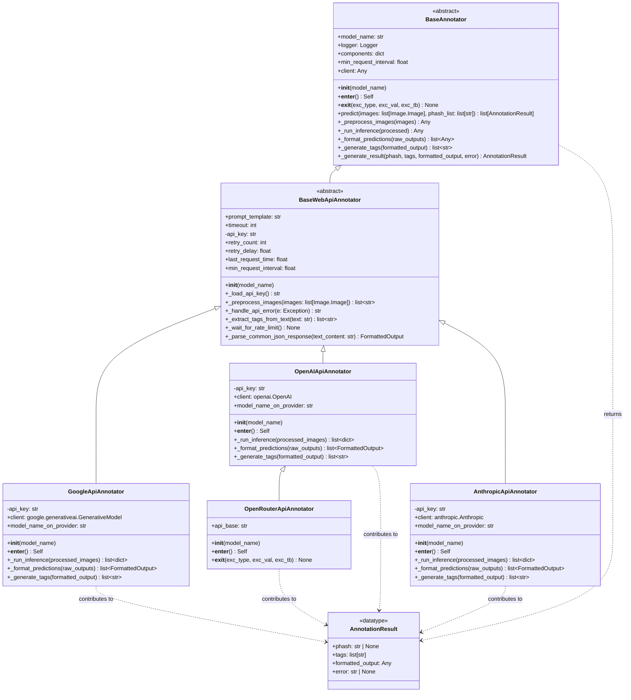

# Web API ベースのマルチモーダルアノテーター設計プラン (改訂版)

## 1. 目的

`image-annotator-lib` に、外部の Web API (Google Gemini, OpenAI GPT-4o, Anthropic Claude 3, OpenRouter 経由モデル) を利用して画像アノテーションを行う機能を追加する。

## 2. 設計方針

- 既存の `BaseAnnotator` の設計を踏襲し、API プロバイダーごとに専用の具象クラスを作成する。
- 各クラスは対応する API の SDK または汎用 HTTP クライアントを利用して API 通信を行う。
- **API キーは `.env` ファイルに記述し、環境変数経由で読み込む。設定ファイル (`annotator_config.toml`) には記述しない。**
- 設定ファイル (`annotator_config.toml`) でモデル名、プロンプトなどを管理する。
- OpenRouter は OpenAI 互換 API を提供するラッパーであるため、専用クラスで `httpx` を使用して実装する。
- **戻り値構造**:
  - `BaseAnnotator.predict`メソッドの戻り値は `list[AnnotationResult]` 型で、各画像ごとに `AnnotationResult` を返す。
  - API モジュールの `annotate` 関数は複数のモデルに対応するため `{image_hash: {model_name: AnnotationResult}}` の形式でハッシュと結果を関連付ける。
  - `AnnotationResult` は `{tags: [], formatted_output: {}, error: None}` の構造を持つ。

## 3. クラス構成



## 4. 主な実装内容

- **新規クラス作成**:

  - `src/image_annotator_lib/core/base.py`: `BaseWebApiAnnotator`
  - `src/image_annotator_lib/model_class/annotator_webapi.py`: `GoogleApiAnnotator`
  - `src/image_annotator_lib/model_class/annotator_webapi.py`: `OpenAIApiAnnotator`
  - `src/image_annotator_lib/model_class/annotator_webapi.py`: `AnthropicApiAnnotator`
  - `src/image_annotator_lib/model_class/annotator_webapi.py`: `OpenRouterApiAnnotator`

- **BaseWebApiAnnotator の主要機能**:

  - API キー管理: 環境変数から API キーを読み込み、存在しない場合はエラーを発生させる
  - 画像の Base64 エンコード: `_preprocess_images` メソッド内で実装
  - レート制限処理: API リクエスト間隔を調整する機能
  - リトライメカニズム: API リクエスト失敗時の再試行処理
  - エラーハンドリング: 各種エラーの捕捉と適切なメッセージ変換
  - テキスト解析: API レスポンスからタグを抽出する基本機能
  - JSON 解析: API レスポンスの JSON 文字列を解析する共通ヘルパー機能 (`_parse_common_json_response`)
  - **設定値の共通読み込み**: `__init__` 内で `annotator_config.toml` から `prompt_template`, `timeout`, `retry_count`, `retry_delay`, `min_request_interval`, `model_name_on_provider` を読み込み、型キャストとデフォルト値設定を行う。

- **共通メソッド実装**:

  ```python
  class BaseWebApiAnnotator(BaseAnnotator):
      """Web API アノテーターの抽象基底クラス"""

      def __init__(self, model_name: str):
          super().__init__(model_name)
          # 設定ファイルから読み込む共通パラメータ
          self.prompt_template = config_registry.get(self.model_name, "prompt_template", "Describe this image.")
          # timeout を int にキャスト
          timeout_val = config_registry.get(self.model_name, "timeout", 60)
          try:
              self.timeout = int(timeout_val)
          except (ValueError, TypeError):
              self.logger.warning(f"timeout に不正な値 {timeout_val} が設定されました。デフォルトの 60 を使用します。")
              self.timeout = 60

          # レート制限とリトライの設定
          # retry_count を int にキャスト
          retry_count_val = config_registry.get(self.model_name, "retry_count", 3)
          try:
              self.retry_count = int(retry_count_val)
          except (ValueError, TypeError):
              self.logger.warning(f"retry_count に不正な値 {retry_count_val} が設定されました。デフォルトの 3 を使用します。")
              self.retry_count = 3

          # retry_delay を float にキャスト
          retry_delay_val = config_registry.get(self.model_name, "retry_delay", 1.0)
          try:
              self.retry_delay = float(retry_delay_val)
          except (ValueError, TypeError):
              self.logger.warning(f"retry_delay に不正な値 {retry_delay_val} が設定されました。デフォルトの 1.0 を使用します。")
              self.retry_delay = 1.0

          self.last_request_time = 0.0
          # min_request_interval を float にキャストして型を保証
          min_interval_val = config_registry.get(self.model_name, "min_request_interval", 1.0)
          try:
              self.min_request_interval = float(min_interval_val)
          except (ValueError, TypeError):
              self.logger.warning(
                  f"min_request_interval に不正な値 {min_interval_val} が設定されました。デフォルトの 1.0 を使用します。"
              )
              self.min_request_interval = 1.0

          # model_name_on_provider もここで読み込む (設定ファイルにない場合は None)
          self.model_name_on_provider: str | None = config_registry.get(self.model_name, "model_name_on_provider")

          self.api_key = self._load_api_key()
          self.client: Any = None  # クライアントインスタンス用属性

      @abstractmethod
      def __enter__(self) -> Self:
          # ...
      # ... (他のメソッド)
  ```

- **具象クラスの実装例**:
  各具象クラス (`GoogleApiAnnotator`, `OpenAIApiAnnotator`, `AnthropicApiAnnotator`, `OpenRouterApiAnnotator`) の `__init__` メソッドは、`super().__init__(model_name)` を呼び出した後、`self.model_name_on_provider` が `None` の場合にクラス固有のデフォルト値を設定する処理のみを行います。

  ```python
  class GoogleApiAnnotator(BaseWebApiAnnotator):
      """Google Gemini API を使用するアノテーター"""

      def __init__(self, model_name: str):
          self.provider_name = "Google Gemini"
          self.client: genai.Client | None = None # 型ヒントを修正
          super().__init__(model_name)
          # 設定ファイルで指定されていない場合のデフォルト値
          if self.model_name_on_provider is None:
              self.model_name_on_provider = "gemini-1.5-pro-latest"

      def _load_api_key(self) -> str:
          # ... (実装は変更なし)

      # !!! 注意: Google Gemini API (google-genai SDK) はバイト列を直接受け取るため、
      # !!! 基底クラスの _preprocess_images (Base64文字列を返す) とは異なる実装になる。
      def _preprocess_images(self, images: list[Image.Image]) -> list[bytes]:
          """画像リストをバイトデータのリストに変換する"""
          from io import BytesIO
          encoded_images = []
          for image in images:
              buffered = BytesIO()
              image.save(buffered, format="WEBP")
              encoded_images.append(buffered.getvalue())
          return encoded_images

      # !!! 注意: _preprocess_images からバイト列を受け取るため、引数の型が基底クラスと異なる。
      def _run_inference(self, processed_images: list[bytes]) -> list[Responsedict]:
          """Google Gemini API (google-genai SDK) を使用して推論を実行する"""
          if not self.client:
              raise WebApiError("API クライアントが初期化されていません", provider_name=self.provider_name)
          results: list[Responsedict] = []
          for image_data in processed_images: # バイトデータ
              try:
                  self._wait_for_rate_limit()
                  parts = [
                      types.Part.from_text(text=BASE_PROMPT),
                      # google.generativeai SDK は bytes を直接受け取る
                      types.Part.from_bytes(data=image_data, mime_type="image/webp"),
                  ]
                  # ... (以降の API 呼び出し処理)
              except Exception as e:
                  # ... (エラーハンドリング)
          return results

      def __init__(self, model_name: str):
          self.provider_name = "OpenAI"
          self.client: openai.OpenAI | None = None # 型ヒントを修正
          super().__init__(model_name)
          # 設定ファイルで指定されていない場合のデフォルト値
          if self.model_name_on_provider is None:
              self.model_name_on_provider = "gpt-4o"

      def _load_api_key(self) -> str:
          # ... (実装は変更なし)

  class AnthropicApiAnnotator(WebApiBaseAnnotator):
      """Anthropic Claude API を使用するアノテーター"""

      def __init__(self, model_name: str):
          self.provider_name = "Anthropic"
          self.client: anthropic.Anthropic | None = None # 型ヒントを修正
          super().__init__(model_name)
          # 設定ファイルで指定されていない場合のデフォルト値
          if self.model_name_on_provider is None:
              self.model_name_on_provider = "claude-3-opus-20240229"

      def _load_api_key(self) -> str:
          # ... (実装は変更なし)
      # ... (他のメソッド)

  class OpenRouterApiAnnotator(OpenAIApiAnnotator): # 継承元を修正
      """OpenRouter API を使用するアノテーター"""

      def __init__(self, model_name: str):
          self.provider_name = "OpenRouter"
          # api_base を先に設定
          self.api_base = config_registry.get(model_name, "api_endpoint", "https://openrouter.ai/api/v1")
          # 基底クラス(OpenAIApiAnnotator -> WebApiBaseAnnotator) の __init__ を呼び出す
          super().__init__(model_name) # 親クラスの __init__ 呼び出し
          # 設定ファイルで指定されていない場合のデフォルト値
          if self.model_name_on_provider is None:
              self.model_name_on_provider = "anthropic/claude-3-opus" # 例

      def __enter__(self) -> Self:
          # OpenRouter 用に base_url を指定してクライアントを初期化
          self.client = openai.OpenAI(api_key=self.api_key, base_url=self.api_base)
          if not self.client:
               raise WebApiError(f"{self.provider_name} クライアントの初期化に失敗しました", self.provider_name)
          return self

      def _load_api_key(self) -> str:
          # ... (実装は変更なし)
      # ... (他のメソッド)
  ```

## 5. 設定 (`annotator_config.toml`)

各 Web API モデルに対して、以下のような設定ブロックを追加する (**API キーは記述しない**)。

```toml
[models.gemini-1.5-pro-api]
class = "GoogleApiAnnotator" # モデルクラス
model_name_on_provider = "gemini-1.5-pro"
prompt_template = "Describe this image."
timeout = 90
retry_count = 3
retry_delay = 1.0
min_request_interval = 1.0

[models.gpt-4o-api]
class = "OpenAIApiAnnotator"
model_name_on_provider = "gpt-4o"
prompt_template = "この画像について説明してください。"
timeout = 60
retry_count = 3
retry_delay = 1.0
min_request_interval = 1.0

[models.claude-3-opus-api]
class = "AnthropicApiAnnotator"
model_name_on_provider = "claude-3-opus-20240229"
prompt_template = "What is in this image?"
timeout = 120
retry_count = 3
retry_delay = 1.0
min_request_interval = 1.0

[models.openrouter-llama3-api]
class = "OpenRouterApiAnnotator"
api_endpoint = "https://openrouter.ai/api/v1/chat/completions"
model_name_on_provider = "meta-llama/llama-3-70b-instruct"
prompt_template = "Generate tags for this image."
timeout = 60
retry_count = 3
retry_delay = 1.0
min_request_interval = 1.0
```

## 6. 依存関係

`pyproject.toml` に以下のライブラリを追加する (必要に応じて)。

- `google-generativeai`
- `openai`
- `anthropic`
- `httpx`
- `python-dotenv`

## 7. 運用

- プロジェクトルート (または適切な場所) に `.env` ファイルを作成し、API キーを記述する。
    ```
    # .env example
    GOOGLE_API_KEY=AIza...
    OPENAI_API_KEY=sk-...
    ANTHROPIC_API_KEY=sk-ant-...
    OPENROUTER_API_KEY=sk-or-...
    ```
- `.gitignore` に `.env` を追加し、バージョン管理に含めないようにする。

## 8. エラーハンドリング戦略

エラーハンドリングは以下のケースで適切に処理する:

1. **API キー不足**:

   - 環境変数に API キーが設定されていない場合は、わかりやすいエラーメッセージを含む例外を発生させる。
   - `error` フィールドに「API キーが設定されていません。環境変数 {ENV_VAR} を確認してください。」を設定。

2. **API タイムアウト**:

   - リクエストがタイムアウトした場合は、通信の再試行を X 回まで行う。
   - 最終的にタイムアウトした場合は `error` フィールドに「API リクエストがタイムアウトしました。ネットワーク状況や API の状態を確認してください。」を設定。

3. **API 認証エラー**:

   - 認証失敗の場合は `error` フィールドに「API 認証に失敗しました。API キーの有効性を確認してください。」を設定。

4. **レート制限**:

   - レート制限に達した場合は適切なバックオフ(待機時間を設けて再試行)を実施。
   - 最終的に失敗した場合は `error` フィールドに「API のレート制限に達しました。しばらく待ってから再試行してください。」を設定。

5. **レスポンス形式エラー**:

   - 予期しない形式のレスポンスを受け取った場合は、可能な限り情報を抽出し、`error` フィールドに「API からの応答形式が予期しないものでした。」と詳細を設定。

6. **その他の API 固有エラー**:
   - API 固有のエラーコードやメッセージを適切にキャプチャし、人間が理解しやすいメッセージに変換して `error` フィールドに設定。

**エラー格納方法の変更**:
- `_run_inference` メソッドは、API 呼び出し中にエラーが発生した場合、レスポンスの代わりにエラーメッセージを含む `Responsedict` を返すように変更しました (例: `{"error": "API timeout"}` )。
- これにより、`_format_predictions` メソッドは画像ごとのレスポンスまたはエラーを処理し、対応する `FormattedOutput` を生成します。`FormattedOutput` は、成功時には `{"annotation": ..., "error": None}`、失敗時には `{"annotation": None, "error": "..."}` の形式になります。
- 最終的に `BaseAnnotator.predict` メソッドは、この `FormattedOutput` のエラー情報を使用して `AnnotationResult` を生成します。

## 9. 実装ロードマップと進捗状況

### 完了した作業

- ✅ テスト用 BDD シナリオの作成と実装 (`tests/features/integration/webapi_annotate.feature`)
- ✅ UNIT テスト用ステップ定義の実装 (`tests/step_defs/test_webapi_annotate.py`)
- ✅ テストで想定される戻り値構造の定義と検証
- ✅ `BaseWebApiAnnotator` の基本実装
  - ✅ APIキー読み込み (`_load_api_key`)
  - ✅ 画像前処理 (`_preprocess_images`: Base64エンコード)
  - ✅ レート制限 (`_wait_for_rate_limit`)
  - ✅ エラーハンドリング (`_handle_api_error`)
  - ✅ タグ抽出 (`_extract_tags_from_text`)
  - ✅ JSON 解析ヘルパー (`_parse_common_json_response`)
- ✅ Google Gemini API の実装 (完了)
- ✅ OpenAI GPT-4o API の実装 (完了)
- ✅ Anthropic Claude API の実装 (完了)
- ✅ OpenRouter API の実装 (OpenAI 継承により完了)

### Google Gemini API の主な変更点

1. **プロンプトの改善**:
   - 詳細な画像分析のためのプロンプトテンプレートを追加
   - キャラクター詳細、構図要素、技術的側面のスコアリングを含む体系的な分析構造を実装

2. **レスポンス形式の標準化**:
   - タグ、キャプション、スコアを含む一貫した JSON 形式を定義
   - レスポンススキーマを使用して出力形式を制御

3. **エラーハンドリングの強化**:
   - API特有のエラーパターンに対する適切な処理を追加
   - レート制限やタイムアウトに対する再試行ロジックを実装

4. **パフォーマンス最適化**:
   - 画像のWEBP形式での効率的な転送
   - レート制限に基づく適切なリクエスト間隔の制御

### 今後の計画

- ⬜ `BaseWebApiAnnotator` のリファクタリング
  - ⬜ Lint エラーと型ヒントの修正 (特に `config_registry.get` の戻り値)
  - ⬜ エラーハンドリング機構 (`_handle_api_error`) の改善と網羅性の向上
  - ⬜ リトライロジックの `_run_inference` への統合検討
  - ⬜ ロギングの強化
- ⬜ 各 `xxxApiAnnotator` サブクラスのリファクタリング
  - ⬜ 基底クラスメソッド (`_handle_api_error`, `_extract_tags_from_text`) の適切な利用確認
  - ✅ 各 API クライアントの初期化と終了処理 (`__enter__`, `__exit__`) の共通化
  - ⬜ Lint エラーと型ヒントの修正 (特に `_preprocess_images`, `_run_inference` のシグネチャ)
  - ⬜ 各 API 固有のエラー処理の追加
  - ✅ `OpenRouterApiAnnotator` の `OpenAIApiAnnotator` への継承リファクタリング
- ⬜ タグ抽出ロジック (`_extract_tags_from_text`) の改善
  - ⬜ 多様なレスポンス形式への対応強化 (正規表現、JSON パースの堅牢化)
- ⬜ テストの拡充
  - ⬜ `BaseWebApiAnnotator` の共通メソッドに対するユニットテスト
  - ⬜ 各サブクラスの API 連携部分の統合テスト (モック利用)
  - ⬜ エラーケース、エッジケースのテストシナリオ追加
- ⬜ ドキュメントの更新
  - ✅ リファクタリングに伴う変更点の反映 (JSON解析ヘルパー追加, OpenAI/OpenRouter継承, クライアント初期化/終了共通化)
  - ⬜ 各クラス、メソッドの Docstring の充実
