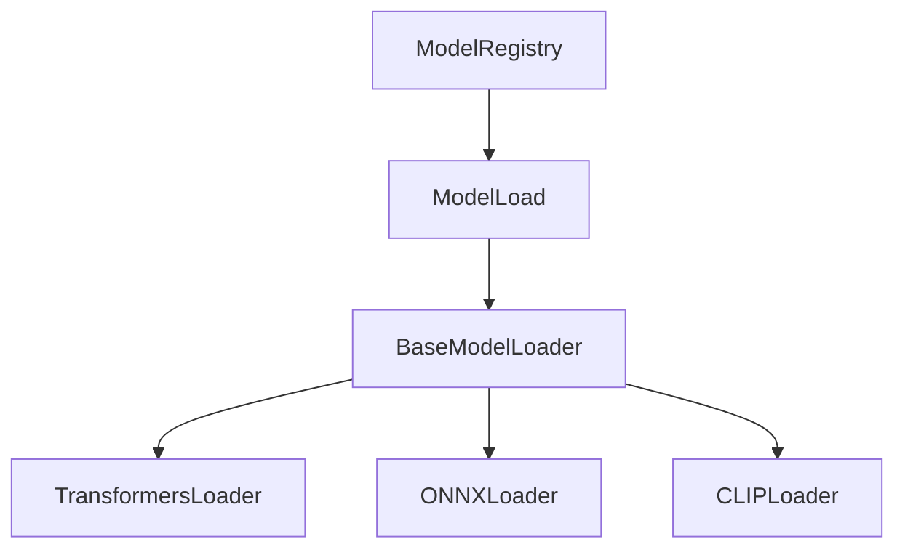

# memory-bank/productContext.md (Updated: 2025/04/05)

## 開発環境の注意点 (パス情報)

ファイルパスの指定ミスを防ぐため、主要なパス情報を以下に記載します。

- **プロジェクトルート:** `dataset-tag-editor-standalone`
  - すべてのファイル操作 (read_file, write_to_file など) は、原則としてこのディレクトリからの相対パスで指定します。
- **`image-annotator-lib` パッケージルート:** `image-annotator-lib/src/image_annotator_lib`
  - ライブラリ内部のモジュールを参照・編集する際の基点となります。
  - 例: `image-annotator-lib/src/image_annotator_lib/core/base.py`

---

## プロジェクト概要

`image-annotator-lib` は、`scorer-wrapper-lib` と `tagger-wrapper-lib` を統合し、画像アノテーション(タギングとスコアリング)機能を提供するライブラリです。

## プロジェクト目標

- コードの重複削減
- 統一された API の提供
- メンテナンス性の向上
- 機能拡張の容易化
- 特に `ModelLoad` (メモリ管理) と `ModelRegistry` (クラス登録) の共通化

## 主要コンポーネントとアーキテクチャ

- **3 層クラス階層**:
  1. `BaseAnnotator`: 全てのアノテーターに共通する基底クラス。共通の `predict` メソッドを提供。
  2. フレームワーク別基底クラス (`ONNXBaseAnnotator`, `TransformersBaseAnnotator`, `TensorflowBaseAnnotator`): 特定フレームワーク共通の処理を実装。
  3. 具象モデルクラス (`WDTagger`, `BLIPTagger`, `DeepDanbooruTagger`, 各 Scorer モデル): 個々のモデル固有の処理を実装。
- **`annotate` 関数 (`api.py`)**: ユーザー向けの主要 API 関数。複数モデル・複数画像の一括処理を提供。
- **`ModelLoad` (`core/model_factory.py`)**: モデルのロード、キャッシュ管理 (CPU 退避/CUDA 復元)、リソース解放を担当。
- **`ModelRegistry` (`core/registry.py`)**: モデルクラスを名前で登録・取得。
- **`core/config.py`**: 設定管理クラス `ModelConfigRegistry` とその共有インスタンス `config_registry` を定義。設定ファイル全体を管理し、設定値へのアクセスを提供する。
- **`core/utils.py`**: ロギング設定 (`setup_logger`) や、ファイル I/O、ネットワーク処理などの共通ユーティリティ関数。
- **共通例外クラス (`exceptions/errors.py`)**: `AnnotatorError`, `ModelLoadError`, `OutOfMemoryError` など。

## 技術スタック

- Python >= 3.12
- PyTorch (Transformers, CLIP)
- ONNX Runtime
- TensorFlow (DeepDanbooru)
- TOML (設定ファイル)
- Ruff (フォーマッター、リンター)
- Mypy (型チェック)
- uv (パッケージ管理)

## 主要な依存関係 (pyproject.toml で管理)

- `toml`
- `requests`
- `huggingface_hub`
- `transformers`
- `onnxruntime` / `onnxruntime-gpu`
- `tensorflow`
- `Pillow`
- `numpy`
- `tqdm`
- `pytest` (テスト用)

## コーディング規約

- 言語: 日本語 (エラーメッセージ、ログ、コメント、Docstring)
- フォーマッター: Ruff format
- リンター: Ruff
- 型チェック: Mypy
- Docstring: Google スタイル (日本語)
- `.cursor\rules` と `docs_image-annotator-lib` を参照してコーディングを進める｡ 変更が必要になった場合はユーザーに判断を仰ぐ｡

### 特に重要なルール (AI 向け)

- **型ヒント:**
  - **モダンな型:** `typing.List` や `typing.Dict`, `Optional` ではなく、Python 3.9 以降の組み込み型 (`list`, `dict`) や `collections.abc` の型を使用すること。
  - **`Any` の回避:** `Any` 型の使用は最小限に留め、具体的な型を指定すること。
  - **エラー抑制禁止:** Mypy や Ruff のエラー/警告は `# type: ignore` や `# noqa` で抑制せず、根本的に解決すること。
- **半角文字:** コード、コメント、ドキュメント内では、**絶対に全角英数字や全角記号を使用しないこと**。
- **原則違反の通知:**
  - AI が定義された原則に違反するコードを生成・編集せざるを得ない場合は、**一度作業を停止し、必ずユーザーにその旨と理由を説明し、指示を仰ぐこと。**
- **問題解決プロセス:**
  - エラー/警告発生時は以下の手順で対応すること。
    1.  **解決策の検討:** 問題の原因を分析し、少なくとも 3 つ以上の異なる解決策を検討する。
    2.  **最適な解決策の選択:** 検討した解決策の中から、最も適切と考えられるものを選択し、その理由を記録する。
    3.  **試行と反復:** 選択した解決策を適用し、問題が解決したか確認する。解決しない場合は、別の解決策を試すか、さらに別の解決策を検討する。
    4.  **エスカレーション:** 上記の試行を 3 回以上繰り返しても問題が解決しない場合は、作業を中断し、ユーザーに状況、試した解決策、考えられる原因を説明し、判断を求める。

## 現在の主要コンポーネント

### ModelLoad (改善中)

- **目的**: 機械学習モデルのロードとメモリ管理
- **新設計**:
  1. 基底ローダー層(BaseModelLoader)
     - 共通インターフェース定義
     - メモリ管理基本機能
  2. 具象ローダー層
     - モデルタイプ固有の実装
     - コンポーネント要件の明確化

### コンポーネント間の関係

### 設計原則

1. 責任の明確な分離
2. モデルタイプごとの独立性
3. 拡張性の確保
4. メモリ管理の一貫性

## 今後の展望

- 新しいモデルタイプへの対応
- メモリ管理の最適化
- テストカバレッジの向上
