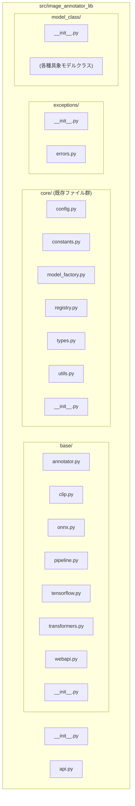

## RFC: `base.py` 分割によるコアコンポーネントの再編計画案

### 1. はじめに

-   **RFC番号:** (採番ルールがあればそれに従う、なければ日付など)
-   **作成日:** 2025-05-23
-   **提案者:** (AI Assistant)
-   **ステータス:** 提案 (Draft)

### 2. 目的

`src/image_annotator_lib/core/base.py` ファイルの肥大化を解消し、以下の点を改善することを目的とします。

-   **可読性の向上:** 各フレームワーク固有の基底クラスを分離することで、コードの見通しを良くします。
-   **保守性の向上:** 関心事の分離により、特定のフレームワークに関連する修正や機能追加が容易になります。
-   **コンポーネントの独立性向上:** 各基底クラスの依存関係を明確にし、影響範囲を限定しやすくします。

### 3. 現状の課題

-   `src/image_annotator_lib/core/base.py` は、抽象基底クラス `BaseAnnotator` に加えて、`TransformersBaseAnnotator`, `TensorflowBaseAnnotator`, `ONNXBaseAnnotator`, `ClipBaseAnnotator`, `PipelineBaseAnnotator`, `WebApiBaseAnnotator` という6つの主要なフレームワーク別基底クラス、および多数の型定義を含んでいます。
-   現在のファイル行数は約1600行に達しており、単一ファイルの責務として過大です。
-   特定のフレームワークに関するコードを検索・編集する際の効率が悪く、誤修正のリスクも高まります。

### 4. 提案する新しいディレクトリ/ファイル構成

`src/image_annotator_lib/core/base.py` を分割し、クラスを再配置します。
既存の `core` ディレクトリは維持し、`base.py` から分割されるコンポーネント以外の既存ファイル (e.g., `config.py`, `model_factory.py`) はそこに残ります。
`base.py` から分割される主要な基底クラス群は、`src/image_annotator_lib/` 直下に新設する `base` ディレクトリ内に配置します。



**具体的なファイル配置案と型定義の移動:**

1.  **`src/image_annotator_lib/base/` (新設)**
    *   `__init__.py`:
        ```python
        # src/image_annotator_lib/base/__init__.py
        from .annotator import BaseAnnotator
        from .clip import ClipBaseAnnotator
        from .onnx import ONNXBaseAnnotator
        from .pipeline import PipelineBaseAnnotator
        from .tensorflow import TensorflowBaseAnnotator
        from .transformers import TransformersBaseAnnotator
        from .webapi import WebApiBaseAnnotator

        __all__ = [
            "BaseAnnotator",
            "ClipBaseAnnotator",
            "ONNXBaseAnnotator",
            "PipelineBaseAnnotator",
            "TensorflowBaseAnnotator",
            "TransformersBaseAnnotator",
            "WebApiBaseAnnotator",
        ]
        ```
    *   `annotator.py`:
        *   `BaseAnnotator` (抽象基底クラス)
            *   `self.components` の型ヒントは `LoaderComponents | None` (core.types からインポート)
        *   (ここに配置していた `AnnotationResult`, `TagConfidence` は `core/types.py` へ移動)
    *   `transformers.py`:
        *   `TransformersBaseAnnotator`
            *   `self.components` の型ヒントは `TransformersComponents | None` (core.types からインポート)
    *   `tensorflow.py`:
        *   `TensorflowBaseAnnotator`
            *   `self.components` の型ヒントは `TensorFlowComponents | None` (core.types からインポート)
    *   `onnx.py`:
        *   `ONNXBaseAnnotator`
            *   `self.components` の型ヒントは `ONNXComponents | None` (core.types からインポート)
    *   `clip.py`:
        *   `ClipBaseAnnotator`
            *   `self.components` の型ヒントは `CLIPComponents | None` (core.types からインポート)
    *   `pipeline.py`:
        *   `PipelineBaseAnnotator`
            *   `self.components` の型ヒントは `TransformersPipelineComponents | None` (core.types からインポート)
    *   `webapi.py`:
        *   `WebApiBaseAnnotator`
            *   `self.components` の型ヒントは `WebApiComponents | None` (core.types からインポート)

2.  **`src/image_annotator_lib/core/`**
    *   `types.py` (既存ファイルを更新):
        *   **ここへ移動・集約する型定義:**
            *   `AnnotationResult` (from `base.py`)
            *   `TagConfidence` (from `base.py`)
            *   `TransformersComponents` (from `base.py`)
            *   `TransformersPipelineComponents` (from `base.py`)
            *   `ONNXComponents` (from `base.py`)
            *   `TensorFlowComponents` (from `base.py`)
            *   `CLIPComponents` (from `base.py`)
            *   `LoaderComponents` (Union型, from `base.py` - 上記Components型を束ねる)
        *   **現状維持の型定義:**
            *   `ApiClient`
            *   `WebApiComponents` (ここに既に存在)
            *   `WebApiInput`
            *   `AnnotationSchema`
            *   `RawOutput`
            *   `WebApiFormattedOutput`
            *   `BaseApiDependencies`, `CommonApiDependencies`, etc.
        *   **廃止:**
            *   `ModelComponents`: この型は、以前各フレームワーク固有のComponents型を個別に型ヒント指定すると煩雑になることを避けるために導入されましたが、今回のリファクタリングで各フレームワーク基底クラスが自身の `self.components` に具体的な型 (例: `TransformersComponents | None`) を持つ方針となったため、汎用的な `ModelComponents` は不要となりました。
    *   `model_factory.py`:
        *   `ModelLoad` クラスの各 `load_..._components` メソッドは、`core/types.py` で定義された対応する `Components` 型 (例: `TransformersComponents`) を返すように型ヒントを明確化。
        *   `restore_model_to_cuda`, `cache_to_main_memory` の引数 `components: dict[str, Any]` は、可能であればより具体的な `LoaderComponents` を受け入れるようにするか、内部での型ガードを強化。
    *   `config.py`, `constants.py`, `registry.py`, `utils.py`, `__init__.py` (大きな変更なし、必要に応じてインポートパス修正)

3.  **`src/image_annotator_lib/__init__.py` (ライブラリ最上位)**
    *   `AnnotationResult` のインポート元を `from .core.types import AnnotationResult` に変更。
    *   必要であれば `BaseAnnotator` を `from .base.annotator import BaseAnnotator` としてインポートし、`__all__` に追加。

*補足: 型定義の配置原則*
*- **共有される型、特にAPIの入出力に使われる型や、複数の主要モジュール (`model_factory`, 各`BaseAnnotator`サブクラス) で利用される型は `core/types.py` に集約します。** これにより、循環参照のリスクを低減し、型定義の一元管理と見通しの良さを目指します。 (`AnnotationResult`, 各種`Components`型, `LoaderComponents`, `TagConfidence` などが該当)
*- **特定のクラスやモジュール内部でのみ利用される型定義は、そのファイル内に局所的に定義します。**
*このリファクタリングの過程で、上記原則に基づき最適な配置を判断します。*

### 5. 影響範囲

この変更は以下の領域に影響します。

-   **`src/image_annotator_lib/model_class/`**:
    -   各具象モデルクラス (`WDTagger`, `AestheticScorer` など) のファイルで、継承している基底クラスのインポート文を新しいパス (`...core.framework_bases.onnx_base` など) に修正する必要があります。
-   **`src/image_annotator_lib/core/registry.py`**:
    -   モデルクラスを動的にインポート・登録するロジックがある場合、基底クラスのパス変更に伴う影響がないか確認が必要です (通常、具象クラスの登録なので直接の影響は少ないと想定)。
-   **`tests/`**:
    -   ユニットテスト (`tests/unit/image_annotator_lib/core/test_base.py` など) や結合テストで、テスト対象クラスのインポート元を修正する必要があります。
    -   `test_base.py` 自体も、テスト対象の分割に合わせて分割・再編が必要になる可能性があります。
-   **既存の `src/image_annotator_lib/core/base.py`**:
    -   このファイルは最終的に削除されるか、`annotator_base.py` にリネームされ、内容が大幅に削減されます。

### 6. Linterエラーへの対応方針 (概要)

`base.py` の分割と型定義の再配置に伴い、多くのLinterエラー (特に型関連) が発生することが予想されます。主な対応方針は以下の通りです。

-   **型の整合性確保:** `ModelLoad` の各メソッドが返す型と、それを `self.components` に代入する各 `BaseAnnotator` サブクラス側での型の整合性を厳密に確認し、修正します。必要に応じて `cast` を使用しますが、極力型推論と型ガードで対応します。
-   **`self.components` の型付け:** `BaseAnnotator` では `self.components: LoaderComponents | None` とし、各サブクラス (例: `TransformersBaseAnnotator`) ではより具体的な型 (例: `self.components: TransformersComponents | None`) でオーバーライドまたは適切に型付けします。
-   **メソッド呼び出しの修正:** `AutoProcessor` の `batch_decode` のような、特定のプロセッサクラスにしかないメソッドを呼び出す際は、`isinstance` で型を確認し、適切な型にキャストしてから呼び出すようにします。
-   **インポートパスの修正:** ファイル移動に伴い、すべてのインポート文を新しいパスに修正します。

これらの対応を通じて、リファクタリング後のコードが型安全で、Linterエラーがない状態を目指します。

### 7. 期待される効果

-   コードベース全体の可読性と理解しやすさが向上します。
-   各コンポーネントの責務がより明確になり、保守性が向上します。
-   特定のフレームワークに関連する変更が、他のフレームワークのコードに影響を与えるリスクが低減します。
-   新規開発者がコード構造を把握しやすくなります。

### 8. 懸念事項と対策

-   **循環参照のリスク:** ファイル分割とインポートの再編成により、意図しない循環参照が発生する可能性があります。
    -   **対策:** 型チェック (`mypy`) やテスト実行を頻繁に行い、早期に検出・修正します。必要に応じて、`TYPE_CHECKING` ブロックや前方参照を活用します。
-   **大規模な変更:** 多数のファイルに影響が及ぶため、マージ時のコンフリクトや見落としが発生する可能性があります。
    -   **対策:** 段階的に作業を進め、各ステップで十分な検証を行います。可能であれば、ペアプログラミングや詳細なレビューを実施します。
-   **テストの修正コスト:** インポートの変更に伴い、多くのテストコードの修正が必要になる可能性があります。
    -   **対策:** 事前に影響範囲を調査し、計画的に修正作業を行います。

--- 